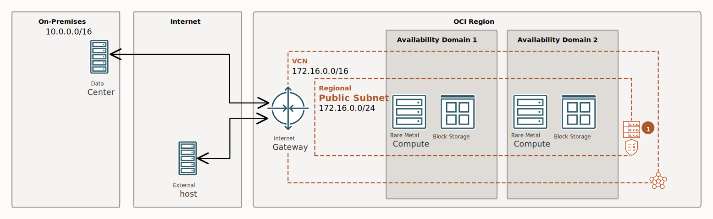

# The Terraform, with the new box

## How to run

### Run the teraform

* In a powershell session, Execute:

```PowerShell
# ---
#  
$Env:TF_LOG = "debug"


terraform init
terraform validate
terraform fmt

terraform plan -out="my.first.powershell.plan.tfplan"
terraform apply -auto-approve "my.first.powershell.plan.tfplan"


```

* Destroy it all:

```PowerShell

terraform plan -destroy -out="my.first.destroy.powershell.plan.tfplan"
terraform apply "my.first.destroy.powershell.plan.tfplan"

```

## Before installing Docker: IP tables

For now, I think the Ingress Rules I setup are good, as far as I understand, and for minio web app access on 9001 port.

I prepare this section, because according my readigs, it seems it might turn out that I need to run an Iptables setup in the VM, to complete the Ingress rules.

If I setup IP tables for my VM, then I have to do it before installing docker, because docker does its own networking setup.

And if so, up until now I figured out that the setup should be something like this, in the VM (but i need to work on that part to understand clearly what i am doing):

```bash
sudo apt-get update -y

# -- I saw this:
sudo iptables -I INPUT -p tcp -m tcp --dport 9001 -j ACCEPT 
# comment option not available in Oracle's Ubuntu # --comment "CUSTOM: allow ingress (see OracleCloud SecurityList for instance's subnet), for Minio"
sudo iptables -I INPUT -p tcp -m tcp --dport 8888 -j ACCEPT  
# comment option not available in Oracle's Ubuntu # --comment "CUSTOM: allow ingress (see OracleCloud SecurityList for instance's subnet), for JupyterLab"
sudo netfilter-persistent save
# sudo  iptables-save | sudo tee -a /etc/iptables/rules.v4

# -- I also saw this (KO): 
sudo iptables -I INPUT 6 -m state --state NEW -p tcp --dport 9001 -j ACCEPT
# - the above command gives me:
# iptables: Index of insertion too big.
sudo iptables -I INPUT 6 -m state --state NEW -p tcp --dport 8888 -j ACCEPT
# - the above command gives me:
# iptables: Index of insertion too big.
sudo netfilter-persistent save

# -- And I even saw this (KO):
sudo iptables -I INPUT 5 -m state --state NEW -p tcp --dport 9001 -j ACCEPT  -m comment --comment "CUSTOM: allow ingress (see OracleCloud SecurityList for instance's subnet), for Minio"
# - the above command gives me:
# iptables: Index of insertion too big.
sudo iptables -I INPUT 5 -m state --state NEW -p tcp --dport 8888 -j ACCEPT  -m comment --comment "CUSTOM: allow ingress (see OracleCloud SecurityList for instance's subnet), for JupyterLab"
# - the above command gives me:
# iptables: Index of insertion too big.

sudo netfilter-persistent save

sudo iptables -L
```

* After applying the iptables above, I get this:

```bash
sudo iptables -L
Chain INPUT (policy ACCEPT)
target     prot opt source               destination
ACCEPT     tcp  --  anywhere             anywhere             tcp dpt:8888
ACCEPT     tcp  --  anywhere             anywhere             tcp dpt:9001
ACCEPT     all  --  anywhere             anywhere             state RELATED,ESTABLISHED
ACCEPT     icmp --  anywhere             anywhere
ACCEPT     all  --  anywhere             anywhere
ACCEPT     udp  --  anywhere             anywhere             udp spt:ntp
ACCEPT     tcp  --  anywhere             anywhere             state NEW tcp dpt:ssh
REJECT     all  --  anywhere             anywhere             reject-with icmp-host-prohibited

Chain FORWARD (policy ACCEPT)
target     prot opt source               destination
REJECT     all  --  anywhere             anywhere             reject-with icmp-host-prohibited

Chain OUTPUT (policy ACCEPT)
target     prot opt source               destination
InstanceServices  all  --  anywhere             link-local/16

Chain InstanceServices (1 references)
target     prot opt source               destination
ACCEPT     tcp  --  anywhere             169.254.0.2          owner UID match root tcp dpt:iscsi-target /* See the Oracle-Provided Images section in the Oracle Cloud Infrastructure documentation for security impact of modifying or removing this rule */
ACCEPT     tcp  --  anywhere             169.254.2.0/24       owner UID match root tcp dpt:iscsi-target /* See the Oracle-Provided Images section in the Oracle Cloud Infrastructure documentation for security impact of modifying or removing this rule */
ACCEPT     tcp  --  anywhere             169.254.4.0/24       owner UID match root tcp dpt:iscsi-target /* See the Oracle-Provided Images section in the Oracle Cloud Infrastructure documentation for security impact of modifying or removing this rule */
ACCEPT     tcp  --  anywhere             169.254.5.0/24       owner UID match root tcp dpt:iscsi-target /* See the Oracle-Provided Images section in the Oracle Cloud Infrastructure documentation for security impact of modifying or removing this rule */
ACCEPT     tcp  --  anywhere             169.254.0.2          tcp dpt:http /* See the Oracle-Provided Images section in the Oracle Cloud Infrastructure documentation for security impact of modifying or removing this rule */
ACCEPT     udp  --  anywhere             169.254.169.254      udp dpt:domain /* See the Oracle-Provided Images section in the Oracle Cloud Infrastructure documentation for security impact of modifying or removing this rule */
ACCEPT     tcp  --  anywhere             169.254.169.254      tcp dpt:domain /* See the Oracle-Provided Images section in the Oracle Cloud Infrastructure documentation for security impact of modifying or removing this rule */
ACCEPT     tcp  --  anywhere             169.254.0.3          owner UID match root tcp dpt:http /* See the Oracle-Provided Images section in the Oracle Cloud Infrastructure documentation for security impact of modifying or removing this rule */
ACCEPT     tcp  --  anywhere             169.254.0.4          tcp dpt:http /* See the Oracle-Provided Images section in the Oracle Cloud Infrastructure documentation for security impact of modifying or removing this rule */
ACCEPT     tcp  --  anywhere             169.254.169.254      tcp dpt:http /* See the Oracle-Provided Images section in the Oracle Cloud Infrastructure documentation for security impact of modifying or removing this rule */
ACCEPT     udp  --  anywhere             169.254.169.254      udp dpt:bootps /* See the Oracle-Provided Images section in the Oracle Cloud Infrastructure documentation for security impact of modifying or removing this rule */
ACCEPT     udp  --  anywhere             169.254.169.254      udp dpt:tftp /* See the Oracle-Provided Images section in the Oracle Cloud Infrastructure documentation for security impact of modifying or removing this rule */
ACCEPT     udp  --  anywhere             169.254.169.254      udp dpt:ntp /* See the Oracle-Provided Images section in the Oracle Cloud Infrastructure documentation for security impact of modifying or removing this rule */
REJECT     tcp  --  anywhere             link-local/16        tcp /* See the Oracle-Provided Images section in the Oracle Cloud Infrastructure documentation for security impact of modifying or removing this rule */ reject-with tcp-reset
REJECT     udp  --  anywhere             link-local/16        udp /* See the Oracle-Provided Images section in the Oracle Cloud Infrastructure documentation for security impact of modifying or removing this rule */ reject-with icmp-port-unreachable

```

Or, with `firewalld`:

```bash
sudo apt-get update -y
sudo apt-get install -y firewalld
sudo systemctl enable firewalld
sudo systemctl status firewalld
sudo systemctl start firewalld
sudo systemctl status firewalld

# -- jupyterlab ssh 22
sudo firewall-cmd --zone=public --add-port=22/tcp --permanent
sudo firewall-cmd --reload
# -- minio http 9001
sudo firewall-cmd --zone=public --add-port=9001/tcp --permanent  #  or --add-service=http for port 80
sudo firewall-cmd --reload
# -- jupyterlab http 8888
sudo firewall-cmd --zone=public --add-port=8888/tcp --permanent  #  or --add-service=http 
sudo firewall-cmd --reload

# --- check all rules / opened ports
sudo firewall-cmd --list-all
# ---- completely disable firewalld:
sudo systemctl stop firewalld
sudo systemctl disable firewalld
sudo systemctl daemon-reload

# --- # --- # --- # --- # --- # --- # --- 
# --- # --- # --- # --- # --- # --- # --- 
# --- After running above commands, I got this with systemctl status firewalld:

# sudo systemctl status firewalld
# ○ firewalld.service - firewalld - dynamic firewall daemon
#      Loaded: loaded (/lib/systemd/system/firewalld.service; disabled; vendor preset: enabled)
#      Active: inactive (dead) since Sun 2024-03-24 11:23:47 UTC; 26s ago
#        Docs: man:firewalld(1)
#    Main PID: 754 (code=exited, status=0/SUCCESS)
#         CPU: 808ms

# Mar 24 11:02:35 DecoderLecoCadeauBOB firewalld[754]: WARNING: COMMAND_FAILED: '/usr/sbin/iptables -w10 -t filter -X DOCKER' failed: iptables: No chain/target/match by that name.
# Mar 24 11:02:35 DecoderLecoCadeauBOB firewalld[754]: WARNING: COMMAND_FAILED: '/usr/sbin/iptables -w10 -t filter -F DOCKER-ISOLATION-STAGE-1' failed: iptables: No chain/target/match by that name.
# Mar 24 11:02:35 DecoderLecoCadeauBOB firewalld[754]: WARNING: COMMAND_FAILED: '/usr/sbin/iptables -w10 -t filter -X DOCKER-ISOLATION-STAGE-1' failed: iptables: No chain/target/match by that name.
# Mar 24 11:02:35 DecoderLecoCadeauBOB firewalld[754]: WARNING: COMMAND_FAILED: '/usr/sbin/iptables -w10 -t filter -F DOCKER-ISOLATION-STAGE-2' failed: iptables: No chain/target/match by that name.
# Mar 24 11:02:35 DecoderLecoCadeauBOB firewalld[754]: WARNING: COMMAND_FAILED: '/usr/sbin/iptables -w10 -t filter -X DOCKER-ISOLATION-STAGE-2' failed: iptables: No chain/target/match by that name.
# Mar 24 11:02:35 DecoderLecoCadeauBOB firewalld[754]: WARNING: COMMAND_FAILED: '/usr/sbin/iptables -w10 -t filter -F DOCKER-ISOLATION' failed: iptables: No chain/target/match by that name.
# Mar 24 11:02:35 DecoderLecoCadeauBOB firewalld[754]: WARNING: COMMAND_FAILED: '/usr/sbin/iptables -w10 -t filter -X DOCKER-ISOLATION' failed: iptables: No chain/target/match by that name.
# Mar 24 11:23:47 DecoderLecoCadeauBOB systemd[1]: Stopping firewalld - dynamic firewall daemon...
# Mar 24 11:23:47 DecoderLecoCadeauBOB systemd[1]: firewalld.service: Deactivated successfully.
# Mar 24 11:23:47 DecoderLecoCadeauBOB systemd[1]: Stopped firewalld - dynamic firewall daemon.
```

For now, non of those configuration work, and after docker installation, I get this, which shows the docker minio container does run normally and responds normally, and is reachable  inside the VM:

```bash
docker ps -a
CONTAINER ID   IMAGE                 COMMAND                  CREATED          STATUS                      PORTS     NAMES
d4d247a1bbad   quay.io/minio/minio   "/usr/bin/docker-ent…"   27 minutes ago   Exited (0) 27 seconds ago             minio
docker start minio
minio
docker ps -a
CONTAINER ID   IMAGE                 COMMAND                  CREATED          STATUS         PORTS                              NAMES
d4d247a1bbad   quay.io/minio/minio   "/usr/bin/docker-ent…"   27 minutes ago   Up 5 seconds   0.0.0.0:9000-9001->9000-9001/tcp   minio
curl -ivvv http://localhost:9001/
*   Trying 127.0.0.1:9001...
  % Total    % Received % Xferd  Average Speed   Time    Time     Time  Current
                                 Dload  Upload   Total   Spent    Left  Speed
  0     0    0     0    0     0      0      0 --:--:-- --:--:-- --:--:--     0* Connected to localhost (127.0.0.1) port 9001 (#0)
> GET / HTTP/1.1
> Host: localhost:9001
> User-Agent: curl/7.81.0
> Accept: */*
>
HTTP/1.1 200 OK
Accept-Ranges: bytes
Content-Length: 1310
Content-Security-Policy: default-src 'self' 'unsafe-eval' 'unsafe-inline';
Content-Type: text/html
Last-Modified: Sun, 24 Mar 2024 11:40:07 GMT
Referrer-Policy: strict-origin-when-cross-origin
Server: MinIO Console
X-Content-Type-Options: nosniff
X-Frame-Options: DENY
X-Xss-Protection: 1; mode=block
Date: Sun, 24 Mar 2024 11:40:07 GMT
Connection: close

<!doctype html><html lang="en"><head><meta charset="utf-8"/><base href="/"/><meta content="width=device-width,initial-scale=1" name="viewport"/><meta content="#081C42" media="(prefers-color-scheme: light)" name="theme-color"/><meta content="#081C42" media="(prefers-color-scheme: dark)" name="theme-color"/><meta content="MinIO Console" name="description"/><meta name="minio-license" content="agpl" /><link href="./styles/root-styles.css" rel="stylesheet"/><link href="./apple-icon-180x180.png" rel="apple-touch-icon" sizes="180x180"/><link href="./favicon-32x32.png" rel="icon" sizes="32x32" type="image/png"/><link href="./favicon-96x96.png" rel="icon" sizes="96x96" type="image/png"/><link href="./favicon-16x16.png" rel="icon" sizes="16x16" type="image/png"/><link href="./manifest.json" rel="manifest"/><link color="#3a4e54" href="./safari-pinned-tab.svg" rel="mask-icon"/><title>MinIO Console</title><script defer="defer" src="./static/js/main.e7860c5b.js"></script><link href="./static/css/main.e60e4760.css" rel="stylesheet"></head><body><noscript>You need to enable JavaScript to run this app.</noscript><div id="root"><div id="preload"> </div><div id="loader-block"></div></div></body></html>* Mark bundle as not supporting multiuse
< HTTP/1.1 200 OK
< Accept-Ranges: bytes
< Content-Length: 1310
< Content-Security-Policy: default-src 'self' 'unsafe-eval' 'unsafe-inline';
< Content-Type: text/html
< Last-Modified: Sun, 24 Mar 2024 11:40:07 GMT
< Referrer-Policy: strict-origin-when-cross-origin
< Server: MinIO Console
< X-Content-Type-Options: nosniff
< X-Frame-Options: DENY
< X-Xss-Protection: 1; mode=block
< Date: Sun, 24 Mar 2024 11:40:07 GMT
< Connection: close
<
{ [1310 bytes data]
100  1310  100  1310    0     0   294k      0 --:--:-- --:--:-- --:--:--  426k
* Closing connection 0
ip addr
1: lo: <LOOPBACK,UP,LOWER_UP> mtu 65536 qdisc noqueue state UNKNOWN group default qlen 1000
    link/loopback 00:00:00:00:00:00 brd 00:00:00:00:00:00
    inet 127.0.0.1/8 scope host lo
       valid_lft forever preferred_lft forever
    inet6 ::1/128 scope host
       valid_lft forever preferred_lft forever
2: enp0s6: <BROADCAST,MULTICAST,UP,LOWER_UP> mtu 9000 qdisc mq state UP group default qlen 1000
    link/ether 02:00:17:00:ae:32 brd ff:ff:ff:ff:ff:ff
    inet 10.23.11.241/24 metric 100 brd 10.23.11.255 scope global enp0s6
       valid_lft forever preferred_lft forever
    inet6 fe80::17ff:fe00:ae32/64 scope link
       valid_lft forever preferred_lft forever
3: docker0: <BROADCAST,MULTICAST,UP,LOWER_UP> mtu 1500 qdisc noqueue state UP group default
    link/ether 02:42:25:da:7c:14 brd ff:ff:ff:ff:ff:ff
    inet 172.17.0.1/16 brd 172.17.255.255 scope global docker0
       valid_lft forever preferred_lft forever
    inet6 fe80::42:25ff:feda:7c14/64 scope link
       valid_lft forever preferred_lft forever
5: veth3131224@if4: <BROADCAST,MULTICAST,UP,LOWER_UP> mtu 1500 qdisc noqueue master docker0 state UP group default
    link/ether 66:24:26:cf:0c:25 brd ff:ff:ff:ff:ff:ff link-netnsid 0
    inet6 fe80::6424:26ff:fecf:c25/64 scope link
       valid_lft forever preferred_lft forever
curl -ivvv http://10.23.11.241:9001/
HTTP/1.1 200 OK
Accept-Ranges: bytes
Content-Length: 1310
Content-Security-Policy: default-src 'self' 'unsafe-eval' 'unsafe-inline';
Content-Type: text/html
Last-Modified: Sun, 24 Mar 2024 11:42:50 GMT
Referrer-Policy: strict-origin-when-cross-origin
Server: MinIO Console
X-Content-Type-Options: nosniff
X-Frame-Options: DENY
X-Xss-Protection: 1; mode=block
Date: Sun, 24 Mar 2024 11:42:50 GMT
Connection: close

<!doctype html><html lang="en"><head><meta charset="utf-8"/><base href="/"/><meta content="width=device-width,initial-scale=1" name="viewport"/><meta content="#081C42" media="(prefers-color-scheme: light)" name="theme-color"/><meta content="#081C42" media="(prefers-color-scheme: dark)" name="theme-color"/><meta content="MinIO Console" name="description"/><meta name="minio-license" content="agpl" /><link href="./styles/root-styles.css" rel="stylesheet"/><link href="./apple-icon-180x180.png" rel="apple-touch-icon" sizes="180x180"/><link href="./favicon-32x32.png" rel="icon" sizes="32x32" type="image/png"/><link href="./favicon-96x96.png" rel="icon" sizes="96x96" type="image/png"/><link href="./favicon-16x16.png" rel="icon" sizes="16x16" type="image/png"/><link href="./manifest.json" rel="manifest"/><link color="#3a4e54" href="./safari-pinned-tab.svg" rel="mask-icon"/><title>MinIO Console</title><script defer="defer" src="./static/js/main.e7860c5b.js"></script><link href="./static/css/main.e60e4760.css" rel="stylesheet"></head><body><noscript>You need to enable JavaScript to run this app.</noscript><div id="root"><div id="preload"> </div><div id="loader-block"></div></div></body></html>*   Trying 10.23.11.241:9001...
  % Total    % Received % Xferd  Average Speed   Time    Time     Time  Current
                                 Dload  Upload   Total   Spent    Left  Speed
  0     0    0     0    0     0      0      0 --:--:-- --:--:-- --:--:--     0* Connected to 10.23.11.241 (10.23.11.241) port 9001 (#0)
> GET / HTTP/1.1
> Host: 10.23.11.241:9001
> User-Agent: curl/7.81.0
> Accept: */*
>
* Mark bundle as not supporting multiuse
< HTTP/1.1 200 OK
< Accept-Ranges: bytes
< Content-Length: 1310
< Content-Security-Policy: default-src 'self' 'unsafe-eval' 'unsafe-inline';
< Content-Type: text/html
< Last-Modified: Sun, 24 Mar 2024 11:42:50 GMT
< Referrer-Policy: strict-origin-when-cross-origin
< Server: MinIO Console
< X-Content-Type-Options: nosniff
< X-Frame-Options: DENY
< X-Xss-Protection: 1; mode=block
< Date: Sun, 24 Mar 2024 11:42:50 GMT
< Connection: close
<
{ [512 bytes data]
100  1310  100  1310    0     0  1920k      0 --:--:-- --:--:-- --:--:-- 1279k
* Closing connection 0

```

## Install docker in VM

* About Firewalld and Docker:
  * <https://docs.docker.com/network/packet-filtering-firewalls/>
  * <https://docs.rockylinux.org/guides/security/firewalld/#iptables-guide-to-firewalld-introduction>
* This works for installing docker on the Ubuntu 22 image i chose : https://docs.docker.com/engine/install/ubuntu/

```bash
# Add Docker's official GPG key:
sudo apt-get update -y
sudo apt-get install -y ca-certificates curl
sudo install -m 0755 -d /etc/apt/keyrings
sudo curl -fsSL https://download.docker.com/linux/ubuntu/gpg -o /etc/apt/keyrings/docker.asc
sudo chmod a+r /etc/apt/keyrings/docker.asc

# Add the repository to Apt sources:
echo \
  "deb [arch=$(dpkg --print-architecture) signed-by=/etc/apt/keyrings/docker.asc] https://download.docker.com/linux/ubuntu \
  $(. /etc/os-release && echo "$VERSION_CODENAME") stable" | \
  sudo tee /etc/apt/sources.list.d/docker.list > /dev/null

sudo apt-get update -y

sudo apt-get install -y docker-ce docker-ce-cli containerd.io docker-buildx-plugin docker-compose-plugin

sudo groupadd docker

sudo usermod -aG docker $USER

sudo reboot -h now

```

* test a container:

```bash
sudo mkdir -p ~/minio/data
sudo docker run -d \
   -p 0.0.0.0:9000:9000 \
   -p 0.0.0.0:9001:9001 \
   --name minio \
   -v ~/minio/data:/data \
   -e "MINIO_ROOT_USER=ROOTNAME" \
   -e "MINIO_ROOT_PASSWORD=CHANGEME123" \
   quay.io/minio/minio server /data --console-address ":9001"
```

## Set up

RSA key pair for provider authentication (then add the pub key to user's API KEys):

```bash
# --- private key
openssl genrsa -out ~/.oci/clef_oracle_cloud.pem 2048
chmod 600 ~/.oci/clef_oracle_cloud.pem
# --- associated pub key
openssl rsa -pubout -in ~/.oci/clef_oracle_cloud.pem -out $HOME/.oci/clef_oracle_cloud.public.pem
```

* Now VM ssh key pair

```bash
mkdir -p ~/.decoderleco/compte.oci.a.bobo/
ssh-keygen -t rsa -N "" -b 2048 -C "jb@boboscloud.on.oracle.io" -f ~/.decoderleco/compte.oci.a.bobo/id_rsa
```

## ANNEX Networking



* You do need all of those to get access to your VM hitting public IP Address:
  * Internet Gateway and NAT Gateway
  * a VCN RouteTable

* Then you need to add an Ingress Rule(s) for your VCN, in your terraform code, according:
  * <https://registry.terraform.io/providers/oracle/oci/latest/docs/resources/core_security_list>
  * <https://github.com/search?q=resource+oci_core_security_list&type=code>
  * <https://github.com/oracle/terraform-provider-oci/blob/e95fac9bee135b539b6db97395984677373231ff/infrastructure/resource_discovery/transient/core.tf#L441C1-L470C4>
  * <https://github.com/hiddify/Hiddify-Manager/blob/dd7517e0fdc3d99344bb62f5873a4bf4941399c1/btn-deploy/oracle/security-lists.tf#L5>
  * <https://docs.oracle.com/en-us/iaas/developer-tutorials/tutorials/apache-on-ubuntu/01oci-ubuntu-apache-summary.htm>
  * <https://medium.com/oracledevs/white-list-your-ip-address-to-security-connect-to-an-oci-compute-instance-4fb99958f0d9>

then to modify the state of my inrfa, after just adding the security rules, with ingress rules, I ran:

```bash
terraform validate
terraform fmt

terraform plan -out="add.ingress.test1.powershell.plan.tfplan"
terraform apply -auto-approve "add.ingress.test1.powershell.plan.tfplan"

```

* About configuring authorization of external access to http port numbers in the VM:
  * https://stackoverflow.com/questions/62326988/cant-access-oracle-cloud-always-free-compute-http-port
  * https://docs.oracle.com/en-us/iaas/developer-tutorials/tutorials/apache-on-ubuntu/01oci-ubuntu-apache-summary.htm
  * https://abeerm171.medium.com/part-2-applying-security-list-to-subnets-in-oracle-cloud-using-terraform-82bd0c087eac
  * https://registry.terraform.io/providers/oracle/oci/latest/docs/resources/core_security_list

## ANNEX: always free resources

* <https://docs.oracle.com/en-us/iaas/Content/FreeTier/freetier_topic-Always_Free_Resources.htm>

## ANNEX References

* maybe we miss the gateway : https://dev.to/farisdurrani/using-terraform-to-deploy-an-oci-compute-instance-harder-5c52
* error about missing ShapeConfig: https://github.com/oracle/terraform-provider-oci/issues/1917

## The last error

We are for now at this error about the OS image:

```bash
PS C:\Users\Utilisateur\packman\oracle> terraform apply -auto-approve "my.first.powershell.plan.tfplan"
oci_core_instance.ubuntu_instance: Creating...
╷
│ Error: 400-InvalidParameter, Shape VM.Standard.A1.Flex is not valid for image ocid1.image.oc1.eu-paris-1.aaaaaaaaf7irdvozuzmwyvbfacdivomj52x65vr6tlg62i6er323sevazdqq.
│ Suggestion: Please update the parameter(s) in the Terraform config as per error message Shape VM.Standard.A1.Flex is not valid for image ocid1.image.oc1.eu-paris-1.aaaaaaaaf7irdvozuzmwyvbfacdivomj52x65vr6tlg62i6er323sevazdqq.
│ Documentation: https://registry.terraform.io/providers/oracle/oci/latest/docs/resources/core_instance
│ API Reference: https://docs.oracle.com/iaas/api/#/en/iaas/20160918/Instance/LaunchInstance
│ Request Target: POST https://iaas.eu-paris-1.oraclecloud.com/20160918/instances
│ Provider version: 5.32.0, released on 2024-03-06.
│ Service: Core Instance
│ Operation Name: LaunchInstance
│ OPC request ID: ec9f94d17fecd6357f6c3f29e0d6c40a/64CEA7A3AC23DF94CE536456D828851C/F9F9EB778E0EC4EC521C2A2A38BC6349
│
│
│   with oci_core_instance.ubuntu_instance,
│   on main.tf line 55, in resource "oci_core_instance" "ubuntu_instance":
│   55: resource "oci_core_instance" "ubuntu_instance" {
│
╵
PS C:\Users\Utilisateur\packman\oracle>
```

* https://docs.oracle.com/en-us/iaas/Content/Rover/Compute/Image/get_image-shape-compatibility-entry.htm

* https://docs.oracle.com/en-us/iaas/Content/Compute/References/images.htm

* https://docs.oracle.com/en-us/iaas/tools/oci-cli/3.37.12/oci_cli_docs/cmdref/compute/image-shape-compatibility-entry/list.html

* https://martincarstenbach.com/2018/11/26/log-in-to-ubuntu-vms-in-oracle-cloud-infrastructure/

* https://stackoverflow.com/questions/61375652/oracle-cloud-instance-connectivity-issue