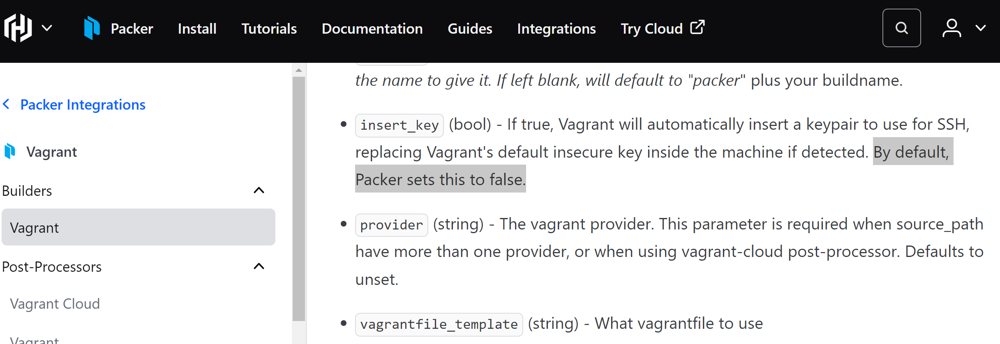
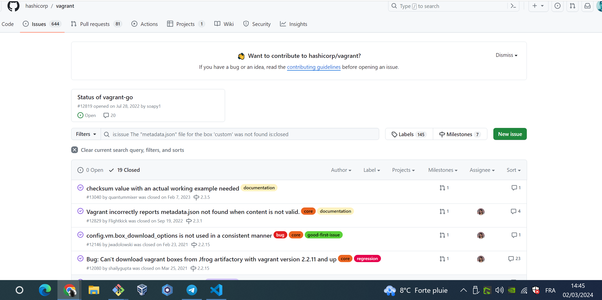
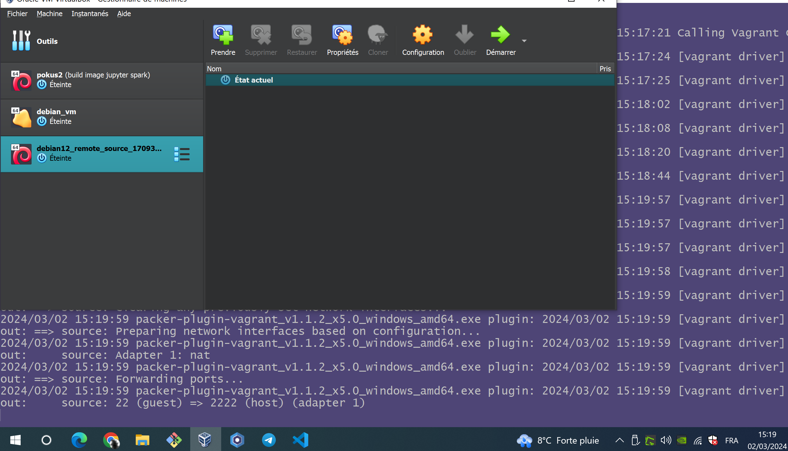

# The Packer part

In the analysis of the terraform provider to provision our debian VM, we ended up with a fully functional debian VM, nevertheless lacking an SSH KEy inside.

Our terraform recipe:
* downloads a vagrant box, from the vagrant boxes registry, in the `ccc` folder.
* 

The purpose of this recipe, is:
* to build, using packer, a new vagrant box, relying on an already existing one in the local filesystem
* the new vagrant box will give a VirutlaBox VM : 
  * with an SSH Key inside
  * with Docker, and Docker compose installed
  * with,if possible, two virtual disks, instead of just one: both dynamically allocated, one is 20GB, the second 40GB for the docker `data-root`

To achieve our goal, we will use Packer's [vagrant](https://developer.hashicorp.com/packer/integrations/hashicorp/vagrant/latest/components/builder/vagrant) builder. That builder we are very interested in, because of two perfect properties for our case:

* we preferable do not want to install vagrant: unforutnaltely, the vagrant packer builder does require to install vagrant.
* we would like to just modify an eisting Vagrant Box.

## (Re)-Install (upgrade) Packer

### On Windows AMD64

#### Git bash for windows

In a git bash for windows shell session, as administrator:

* To install packer, run:

```bash
choco install packer
```

* To upgrade your packer installtion, run:

```bash
choco upgrade packer
```

## Install Vagrant

* Windows AMD64:

```bash

export DESIRED_VAGRANT_VERSION="2.4.1"
export VAGRANT_BIN_DWNLD_LINK="https://releases.hashicorp.com/vagrant/${DESIRED_VAGRANT_VERSION}/vagrant_${DESIRED_VAGRANT_VERSION}_windows_amd64.msi"

curl -LO ${VAGRANT_BIN_DWNLD_LINK}


ls -alh ./vagrant_${DESIRED_VAGRANT_VERSION}_windows_amd64.msi

mkdir -p ~/.bin/vagrant/${DESIRED_VAGRANT_VERSION}/

msiexec -qn -norestart -i "vagrant_${DESIRED_VAGRANT_VERSION}_windows_amd64.msi" VAGRANTAPPDIR="${HOME}/.bin/vagrant/${DESIRED_VAGRANT_VERSION}/"
# - >
# >>> You would then have to restart
# >>> your computer, for the vagrant installation to be complete.
# - >
# mkdir -p ~/.bin/vagrant/${DESIRED_VAGRANT_VERSION}/
# unzip ./ccc -d ~/.bin/vagrant/${DESIRED_VAGRANT_VERSION}/

```

## How it was started

First, I upgraded my `packer` installation, and I got to version:

```bash
$ date && packer --version
Fri Mar  1 20:02:50     2024
Packer v1.10.0

Your version of Packer is out of date! The latest version
is 1.10.1. You can update by downloading from www.packer.io/downloads
```

Following instructions in the [vagrant builder docs](https://developer.hashicorp.com/packer/integrations/hashicorp/vagrant/latest/components/builder/vagrant), I created the Json packer configuration, and then converted it to HCL:

```bash

export CONFIGURED_SOURCE_PATH="ubuntu/focal64"
export CONFIGURED_SOURCE_PATH="ubuntu/focal64"

cat <<EOF >./packer.pkr.json
{
    "provisioners": [
      {
        "type": "shell",
        "execute_command": "echo 'vagrant' | {{.Vars}} sudo -S -E bash '{{.Path}}'",
        "script": "scripts/setup.sh"
      }
    ],
    "builders": [
      {
        "communicator": "ssh",
        "source_path": "ubuntu/focal64",
        "provider": "virtualbox",
        "add_force": true,
        "type": "vagrant"
      }
    ]
  }
EOF
packer hcl2_upgrade -output-file=packer.pkr.hcl packer.pkr.json
```

Finally, I created a `./.base.box` folder, where I copied all the files of the Vagrant box downloaded by the `terra-farm/terraform-provider-virtualbox` from `~/.terraform/virtualbox/gold/virtualbox/`:

```bash
mkdir -p ./.base.box/content
cp -fr ~/.terraform/virtualbox/gold/virtualbox/* ./.base.box/content/

# ---
# A VagrantBox is just a gzip tarball, as of
# the golang source code file 'image.go' of
# the terraform provider, and
#  https://developer.hashicorp.com/vagrant/docs/boxes/format
# - 
# 

# ---
# - [tar + gzip] = [tar -z]
# tar -zcvf ./.base.box/box.tar.gz ./.base.box/content
tar -zcvf ./.base.box/debian12base.box ./.base.box/content
# --- ---
# -- check the content of
# -  the box (a gzip tarball):
# --
# tar -tf ./.base.box/debian12base.box
tar -tf ./.base.box/debian12base.box
# -- ----

export CONFIGURED_SOURCE_PATH="ubuntu/focal64"
export CONFIGURED_SOURCE_PATH="./.base.box/debian12base.box"

cat <<EOF >./packer.pkr.json
{
    "provisioners": [
      {
        "type": "shell",
        "execute_command": "echo 'vagrant' | {{.Vars}} sudo -S -E bash '{{.Path}}'",
        "script": ".shell/.build/setup.sh"
      }
    ],
    "builders": [
      {
        "communicator": "ssh",
        "source_path": "${CONFIGURED_SOURCE_PATH}",
        "provider": "virtualbox",
        "add_force": true,
        "type": "vagrant"
      }
    ]
  }
EOF
rm ./packer.pkr.hcl
packer hcl2_upgrade -output-file=packer.pkr.hcl packer.pkr.json

```

#### First try

resulted with an error, `SSH Port was not properly retrieved from SSHConfig`:

```bash
$ packer build ./packer.pkr.hcl
vagrant.debian12_base: output will be in this color.

==> vagrant.debian12_base: Retrieving Box
==> vagrant.debian12_base: Trying ./.base.box/debian12base.box
==> vagrant.debian12_base: Trying ./.base.box/debian12base.box
==> vagrant.debian12_base: ./.base.box/debian12base.box => C:/Users/Utilisateur/packman/packer/.base.box/debian12base.box
==> vagrant.debian12_base: Creating a Vagrantfile in the build directory...
==> vagrant.debian12_base: Adding box using vagrant box add ...
    vagrant.debian12_base: (this can take some time if we need to download the box)
==> vagrant.debian12_base: Calling Vagrant Up (this can take some time)...
==> vagrant.debian12_base: destroying Vagrant box...
==> vagrant.debian12_base: Deleting output directory...
Build 'vagrant.debian12_base' errored after 3 minutes 55 seconds: error: SSH Port was not properly retrieved from SSHConfig.

==> Wait completed after 3 minutes 55 seconds

==> Some builds didn't complete successfully and had errors:
--> vagrant.debian12_base: error: SSH Port was not properly retrieved from SSHConfig.

==> Builds finished but no artifacts were created.

```

So I modified my `packer.pkr.hcl`, to add box_name and output_dir:

```bash
mkdir -p ./golden/debian12
touch ./golden/debian12/README.md
touch ./golden/README.md

cat <<EOF >./packer.pkr.hcl
packer {
  required_plugins {
    vagrant = {
      source  = "github.com/hashicorp/vagrant"
      version = "~> 1"
    }
  }
}

source "vagrant" "debian12_base" {
  add_force    = true
  communicator = "ssh"
  provider     = "virtualbox"
  source_path  = "./.base.box/debian12base.box"
  box_name     = "golden_debian12"
  output_dir   = "./golden/debian12"
}

build {
  sources = ["source.vagrant.debian12_base"]

  provisioner "shell" {
    execute_command = "echo 'vagrant' | {{ .Vars }} sudo -S -E bash '{{ .Path }}'"
    script          = ".shell/.build/setup.sh"
  }

}
EOF

```

I then had an error specifyi that my output directory already exist:

```bash
$ packer build ./packer.pkr.hcl
vagrant.debian12_base: output will be in this color.

==> vagrant.debian12_base: Retrieving Box
==> vagrant.debian12_base: Trying ./.base.box/debian12base.box
==> vagrant.debian12_base: Trying ./.base.box/debian12base.box
==> vagrant.debian12_base: ./.base.box/debian12base.box => C:/Users/Utilisateur/packman/packer/.base.box/debian12base.box
Build 'vagrant.debian12_base' errored after 297 milliseconds 581 microseconds: Output directory exists: ./golden/debian12

Use the force flag to delete it prior to building.

==> Wait completed after 297 milliseconds 581 microseconds

==> Some builds didn't complete successfully and had errors:
--> vagrant.debian12_base: Output directory exists: ./golden/debian12

Use the force flag to delete it prior to building.

==> Builds finished but no artifacts were created.

```

So I destroyed the folder by running `rm -fr golden/debian12/`, and launched the packer build again: to fall again on that error `ccc`

That's where i googled that error, and found this blog post: <https://bsago.me/tech-notes/create-vagrant-boxes-with-packer#:~:text=error%3A%20SSH%20Port%20was%20not,one%20of%20many%20other%20things>

It was dealing with another problem, than my own, _but_, it was explaining how to use the `template` option, the path to a `Vagrantfile` template, that you would base on the orginal one, here our `./packer/.base.box/content/Vagrantfile`.

And this post was showing a template which did include the way to insert the SSH key to use :

```Vagrant
Vagrant.configure(2) do |config|
  config.vm.define "source", autostart: false do |source|
    source.vm.box = "{{.SourceBox}}"
    config.ssh.insert_key = {{.InsertKey}}
  end

  config.vm.define "output" do |output|
    output.vm.box = "{{.BoxName}}"
    output.vm.box_url = "file://package.box"
    config.ssh.insert_key = {{.InsertKey}}
  end

  # These ‘provider’ definitions are not present in the original template.
  config.vm.provider "virtualbox" do |v|
    v.memory = 4096
    v.cpus = `nproc`.to_i
  end

  config.vm.provider "vmware_desktop" do |v|
    v.vmx['memsize'] = 4096
    v.vmx['numvcpus'] = `nproc`.to_i
  end

  {{if ne .SyncedFolder "" -}}
    config.vm.synced_folder "{{.SyncedFolder}}", "/vagrant"
  {{- else -}}
    config.vm.synced_folder ".", "/vagrant", disabled: true
  {{- end}}
end
```

This template Vagrantfile drove me to <https://developer.hashicorp.com/vagrant/docs/vagrantfile/ssh_settings>, where I found my configuration option:

* For Vagrant, the `config.ssh.insert_key` configuration option is true by default
* Yet, the Packer Vagrant builder [sets `config.ssh.insert_key` to `false` by default](https://developer.hashicorp.com/packer/integrations/hashicorp/vagrant/latest/components/builder/vagrant#optional):



There we are, I should set `insert_key   = true`:

```bash

rm -fr ./golden/debian12

cat <<EOF >./packer.pkr.hcl
packer {
  required_plugins {
    vagrant = {
      source  = "github.com/hashicorp/vagrant"
      version = "~> 1"
    }
  }
}

source "vagrant" "debian12_base" {
  add_force    = true
  communicator = "ssh"
  provider     = "virtualbox"
  source_path  = "./.base.box/debian12base.box"
  box_name     = "golden_debian12"
  output_dir   = "./golden/debian12"
  insert_key   = true
}

build {
  sources = ["source.vagrant.debian12_base"]

  provisioner "shell" {
    execute_command = "echo 'vagrant' | {{ .Vars }} sudo -S -E bash '{{ .Path }}'"
    script          = ".shell/.build/setup.sh"
  }

}
EOF

```

And I ran the packer build again... To find the same error.

I searched a bitmore, and added a template Vagrantfile, which content was exactly the same asthe base Vagrantfile, except I added a provider specific network interface config, plsu a section inspired by the above mentioned blog post, which gave me this Vagrantfile template:

```Vagrantfile

# The contents below were provided by the Packer Vagrant post-processor

Vagrant.configure("2") do |config|
  config.vm.base_mac = "0800276B552B"
end


# The contents below (if any) are custom contents provided by the
# Packer template during image build.
# -*- mode: ruby -*-
# vi: set ft=ruby :

Vagrant.configure(2) do |config|

  # ---
  # config.ssh.private_key_path = ""
  # config.ssh.username = "vagrant" 
  # config.ssh.password = "vagrant"
  config.ssh.port     = 22
  
  config.vm.define "source", autostart: true do |source|
    source.vm.box = "{{.SourceBox}}"
    config.ssh.insert_key = {{.InsertKey}}
  end

  config.vm.define "output" do |output|
    output.vm.box = "{{.BoxName}}"
    # output.vm.box_url = "file://package.box"
    config.ssh.insert_key = {{.InsertKey}}
  end
  
  config.vm.boot_timeout = 1800
  config.vm.synced_folder ".", "/vagrant", disabled: true

  config.vm.box_check_update = true

  # config.vm.post_up_message = ""
  config.vm.boot_timeout = 1800
  # config.vm.box_download_checksum = true
  config.vm.boot_timeout = 1800
  # config.vm.box_download_checksum_type = "sha256"

  # config.vm.provision "shell", run: "always", inline: <<-SHELL
  # SHELL

  # Adding a second CPU and increasing the RAM to 2048MB will speed
  # things up considerably should you decide to do anythinc with this box.
  config.vm.provider :hyperv do |v, override|
    v.maxmemory = 2048
    v.memory = 2048
    v.cpus = 2
  end

  config.vm.provider :libvirt do |v, override|
    v.disk_bus = "virtio"
    v.driver = "kvm"
    v.video_vram = 256
    v.memory = 2048
    v.cpus = 2
  end

  config.vm.provider :parallels do |v, override|
    v.customize ["set", :id, "--on-window-close", "keep-running"]
    v.customize ["set", :id, "--startup-view", "headless"]
    v.customize ["set", :id, "--memsize", "2048"]
    v.customize ["set", :id, "--cpus", "2"]
  end

  config.vm.provider :virtualbox do |v, override|
    v.customize ["modifyvm", :id, "--memory", 4096]
    v.customize ["modifyvm", :id, "--vram", 2048]
    v.customize ["modifyvm", :id, "--cpus", 4]
    v.customize ["modifyvm", :id, "--cable-connected1", "on"]
    v.customize ["modifyvm", :id, "--nic1", "bridged"]
    v.customize ["modifyvm", :id, "--bridge-adapter1", "TP-Link Wireless USB Adapter"]
    v.gui = true
  end

  ["vmware_fusion", "vmware_workstation", "vmware_desktop"].each do |provider|
    config.vm.provider provider do |v, override|
      v.whitelist_verified = true
      v.gui = false
      v.vmx["cpuid.coresPerSocket"] = "1"
      v.vmx["memsize"] = "2048"
      v.vmx["numvcpus"] = "2"
    end
  end

end
```

That's where I understood something extremely important when working with `Packer`:

* I searched a bit and found very quickly how to change Packer's log level, changing it to debug: `export PACKER_LOG=debug`
* And as I ran again my Packerbuild,i finally found the error: `2024/03/01 22:34:39 packer-plugin-vagrant_v1.1.2_x5.0_windows_amd64.exe plugin: 2024/03/01 22:34:39 [vagrant driver] stderr: The "metadata.json" file for the box './.base.box/debian12base.box' was not found.`.
* Absolutely nothing to do with any SSH configuration!
* soon i found a few related github issue on vagrant's github repository (I'm not alone in the world!):
  * this one is very interesting, its quite recent, and states the exact same issue as me (as I write this, March, 1st, 2024, and the issue dats bck to July 2022). Most Interesting also, the issuer tarballs the box for testing, using `tar -cvf`, while I used `tar -zcvf` instead : <https://github.com/hashicorp/vagrant/issues/12829>
  * even more interesting, there are **19** (!) closed issues which mention the `metadata.json` file: <https://github.com/hashicorp/vagrant/issues?q=is%3Aissue+The+%22metadata.json%22+file+for+the+box+%27custom%27+was+not+found+is%3Aclosed>



* _**What I understood then**_: Packer works with plugins, this means that when a given plugin fails with an error, packer can only spito ut what the plugin passed him. So it is exetremely important torun packer with debug log level, to troubleshoot most of the difficulties experienced using a Packer builder.

Now, what i naturally did, to test if it was menot packaging well my tarball vagrant box:

* Instead of   `source_path  = "./.base.box/debian12base.box"`
* I used `source_path  = "https://app.vagrantup.com/generic/boxes/debian12/versions/4.3.12/providers/virtualbox.box"`
* That, because my vagrant box was indeed coming from https://app.vagrantup.com/generic/boxes/debian12/versions/4.3.12/providers/virtualbox.box , and it was the terraform provider who deflatedit, letting meplay with the following files on my local filesystem:

```bash
$ ls -alh ~/.terraform/virtualbox/gold/virtualbox/
total 1.2G
drwxr-xr-x 1 <My User> 197121    0 Feb 26 21:45 ./
drwxr-xr-x 1 <My User> 197121    0 Feb 26 21:45 ../
-rw-r--r-- 1 <My User> 197121 2.0K Jan 10 05:36 Vagrantfile
-rw-r--r-- 1 <My User> 197121 6.7K Jan 10 05:36 box.ovf
-rw-r--r-- 1 <My User> 197121 1.2G Feb 26 21:45 generic-debian12-virtualbox-x64-disk001.vmdk
-rw-r--r-- 1 <My User> 197121  301 Jan 10 05:36 info.json
-rw-r--r-- 1 <My User> 197121   49 Jan 10 05:36 metadata.json
```

No need to tell you that re-downloadingthe whole vagrant box isavery long test, and I will soon findout if the box is corrupted.

But I learned my lesson tonight. Next episode tomorrow.

Beforegoing tosleep, as i finished writing my documentation, the Packer build based on the https URL of the debian 12 vagrant box, completed its execution, with an errorI already knowwhat it is about (I need to run the samepackerbuild in powershell, not in git bash for windows, typical its like terraform, the golang binary searches for native widows file paths):

```bash
2024/03/01 23:43:31 packer-plugin-vagrant_v1.1.2_x5.0_windows_amd64.exe plugin: 2024/03/01 23:43:31 [vagrant driver] stderr: C:/Program Files/Vagrant/embedded/mingw64/lib/ruby/3.1.0/fileutils.rb:243:in `mkdir': No such file or directory @ dir_s_mkdir - C:/Users/Utilisateur/.vagrant.d/boxes/https-VAGRANTCOLON--VAGRANTSLASH--VAGRANTSLASH-app.vagrantup.com-VAGRANTSLASH-generic-VAGRANTSLASH-boxes-VAGRANTSLASH-debian12-VAGRANTSLASH-versions-VAGRANTSLASH-4.3.12-VAGRANTSLASH-providers-VAGRANTSLASH-virtualbox.box (Errno::ENOENT)

```

Good night, with a little more documentation.

The next day, cosy afternoon, a good sleep the night before. I look again at the error I stopped work on yesterday, and an idea shows up:

* the error states that some file apparently does not exists, on my filesystem, the `C:/Users/Utilisateur/.vagrant.d/boxes/https-VAGRANTCOLON--VAGRANTSLASH--VAGRANTSLASH-app.vagrantup.com-VAGRANTSLASH-generic-VAGRANTSLASH-boxes-VAGRANTSLASH-debian12-VAGRANTSLASH-versions-VAGRANTSLASH-4.3.12-VAGRANTSLASH-providers-VAGRANTSLASH-virtualbox.box`
* So lets check that:

```bash

ls -alh /C/Users/Utilisateur/.vagrant.d/
ls -alh /C/Users/Utilisateur/.vagrant.d/boxes/
ls -alh /C/Users/Utilisateur/.vagrant.d/boxes/https-VAGRANTCOLON--VAGRANTSLASH--VAGRANTSLASH-app.vagrantup.com-VAGRANTSLASH-generic-VAGRANTSLASH-boxes-VAGRANTSLASH-debian12-VAGRANTSLASH-versions-VAGRANTSLASH-4.3.12-VAGRANTSLASH-providers-VAGRANTSLASH-virtualbox.box
```

Result:

```bash
$ ls -alh /C/Users/Utilisateur/.vagrant.d/
total 145K
drwxr-xr-x 1 Utilisateur 197121    0 Mar  1 23:43 ./
drwxr-xr-x 1 Utilisateur 197121    0 Mar  2 02:07 ../
drwxr-xr-x 1 Utilisateur 197121    0 Mar  1 23:23 boxes/
drwxr-xr-x 1 Utilisateur 197121    0 Mar  1 23:43 data/
drwxr-xr-x 1 Utilisateur 197121    0 Mar  1 20:15 gems/
-rw-r--r-- 1 Utilisateur 197121 1.7K Mar  1 20:15 insecure_private_key
drwxr-xr-x 1 Utilisateur 197121    0 Mar  1 20:15 insecure_private_keys/
drwxr-xr-x 1 Utilisateur 197121    0 Mar  1 20:15 rgloader/
-rw-r--r-- 1 Utilisateur 197121    3 Mar  1 20:15 setup_version
drwxr-xr-x 1 Utilisateur 197121    0 Mar  1 23:43 tmp/

$ ls -alh /C/Users/Utilisateur/.vagrant.d/boxes/
total 4.0K
drwxr-xr-x 1 Utilisateur 197121 0 Mar  1 23:23 ./
drwxr-xr-x 1 Utilisateur 197121 0 Mar  1 23:43 ../
drwxr-xr-x 1 Utilisateur 197121 0 Mar  1 23:23 golden_debian12/

$ ls -alh /C/Users/Utilisateur/.vagrant.d/boxes/https-VAGRANTCOLON--VAGRANTSLASH--VAGRANTSLASH-app.vagrantup.com-VAGRANTSLASH-generic-VAGRANTSLASH-boxes-VAGRANTSLASH-debian12-VAGRANTSLASH-versions-VAGRANTSLASH-4.3.12-VAGRANTSLASH-providers-VAGRANTSLASH-virtualbox.box
ls: cannot access '/C/Users/Utilisateur/.vagrant.d/boxes/https-VAGRANTCOLON--VAGRANTSLASH--VAGRANTSLASH-app.vagrantup.com-VAGRANTSLASH-generic-VAGRANTSLASH-boxes-VAGRANTSLASH-debian12-VAGRANTSLASH-versions-VAGRANTSLASH-4.3.12-VAGRANTSLASH-providers-VAGRANTSLASH-virtualbox.box': No such file or directory

```

* Now Note that:
  * There is a folder that does exist, the `/C/Users/Utilisateur/.vagrant.d/boxes/golden_debian12/` folder.
  * And the error message is right, on my filesystem, there is no existing file or folder with path `/C/Users/Utilisateur/.vagrant.d/boxes/https-VAGRANTCOLON--VAGRANTSLASH--VAGRANTSLASH-app.vagrantup.com-VAGRANTSLASH-generic-VAGRANTSLASH-boxes-VAGRANTSLASH-debian12-VAGRANTSLASH-versions-VAGRANTSLASH-4.3.12-VAGRANTSLASH-providers-VAGRANTSLASH-virtualbox.box`
  * That, in my `packer.pkr.hcl` file, I gave to the :
    * `box_name` configuration property, the value `golden_debian12`.
    * `source_path` configuration property, the value `https://app.vagrantup.com/generic/boxes/debian12/versions/4.3.12/providers/virtualbox.box`.
  * That on the [packer builder page](https://developer.hashicorp.com/packer/integrations/hashicorp/vagrant/latest/components/builder/vagrant), the provided example, gives to the :
    * `source_path` configuration property, the value `hashicorp/precise64`.
    * That this `hashicorp/precise64` Vagrant box is available at <https://app.vagrantup.com/hashicorp/boxes/precise64>, and that the latest version of that box, for the virtualbox provider, can be downloaded with the URL [`https://app.vagrantup.com/hashicorp/boxes/precise64/versions/1.1.0/providers/virtualbox.box`](https://app.vagrantup.com/hashicorp/boxes/precise64/versions/1.1.0/providers/virtualbox.box)

  * So If I follow the same pattern asthe Packer vagrant builder, if i want my packer build to use the [`https://app.vagrantup.com/generic/boxes/debian12/versions/4.3.12/providers/virtualbox.box`](https://app.vagrantup.com/generic/boxes/debian12/versions/4.3.12/providers/virtualbox.box), I should then :
    * set the `source_path` to `generic/debian12`
    * set the `box_name` to any name I never used before, to be able to make sure how `box_name` will be used (will i find a `${HOME}/.vagrant.d/boxes/<the new name I never used before>` ?)

I applied those changes in my packer build definition `./packer.pkr.hcl`, and to begin with, bingo, setting `source_path` to `generic/debian12`, resulted in downloading the expected box, see the output:

```bash
out:     box: Downloading: https://vagrantcloud.com/generic/boxes/debian12/versions/4.3.12/providers/virtualbox/amd64/vagrant.box
```

Bingo, the result is that I have a new error, which clearly states that i have an error in my `./packer/.vagrant/debian12/Vagrantfile.tpl` Vagrantfile template, about the video ram size, look (thank you packer logs again):

```bash
err: The following error was experienced:
2024/03/02 15:02:48 packer-plugin-vagrant_v1.1.2_x5.0_windows_amd64.exe plugin: 2024/03/02 15:02:48 [vagrant driver] stderr:
2024/03/02 15:02:48 packer-plugin-vagrant_v1.1.2_x5.0_windows_amd64.exe plugin: 2024/03/02 15:02:48 [vagrant driver] stderr: #<Vagrant::Errors::VBoxManageError: There was an error while executing `VBoxManage`, a CLI used by Vagrant
2024/03/02 15:02:48 packer-plugin-vagrant_v1.1.2_x5.0_windows_amd64.exe plugin: 2024/03/02 15:02:48 [vagrant driver] stderr: for controlling VirtualBox. The command and stderr is shown below.
2024/03/02 15:02:48 packer-plugin-vagrant_v1.1.2_x5.0_windows_amd64.exe plugin: 2024/03/02 15:02:48 [vagrant driver] stderr:
2024/03/02 15:02:48 packer-plugin-vagrant_v1.1.2_x5.0_windows_amd64.exe plugin: 2024/03/02 15:02:48 [vagrant driver] stderr: Command: ["modifyvm", "7ad48baa-3040-491a-8655-7b0dd4c5e519", "--vram", "2048"]
2024/03/02 15:02:48 packer-plugin-vagrant_v1.1.2_x5.0_windows_amd64.exe plugin: 2024/03/02 15:02:48 [vagrant driver] stderr:
2024/03/02 15:02:48 packer-plugin-vagrant_v1.1.2_x5.0_windows_amd64.exe plugin: 2024/03/02 15:02:48 [vagrant driver] stderr: Stderr: VBoxManage.exe: error: Invalid VRAM size: 2048 MB (must be in range [0, 256] MB)

```



Alright, so I will reset the video memory to the maximum value, 256.


And now we getto the famous problem about how toSSH into the booted VM:

```bash
out: ==> source: Waiting for machine to boot. This may take a few minutes...
2024/03/02 15:20:13 packer-plugin-vagrant_v1.1.2_x5.0_windows_amd64.exe plugin: 2024/03/02 15:20:13 [vagrant driver] stdout:     source: SSH address: 127.0.0.1:22
2024/03/02 15:20:13 packer-plugin-vagrant_v1.1.2_x5.0_windows_amd64.exe plugin: 2024/03/02 15:20:13 [vagrant driver] stdout:     source: SSH username: vagrant
2024/03/02 15:20:13 packer-plugin-vagrant_v1.1.2_x5.0_windows_amd64.exe plugin: 2024/03/02 15:20:13 [vagrant driver] stdout:     source: SSH auth method: private key
2024/03/02 15:20:13 packer-plugin-vagrant_v1.1.2_x5.0_windows_amd64.exe plugin: 2024/03/02 15:20:13 [vagrant driver] stdout:     source: Warning: Authentication failure. Retrying...
2024/03/02 15:20:24 packer-plugin-vagrant_v1.1.2_x5.0_windows_amd64.exe plugin: 2024/03/02 15:20:24 [vagrant driver] stdout:     source: Warning: Authentication failure. Retrying...
2024/03/02 15:20:34 packer-plugin-vagrant_v1.1.2_x5.0_windows_amd64.exe plugin: 2024/03/02 15:20:34 [vagrant driver] stdout:     source: Warning: Authentication failure. Retrying...
2024/03/02 15:20:44 packer-plugin-vagrant_v1.1.2_x5.0_windows_amd64.exe plugin: 2024/03/02 15:20:44 [vagrant driver] stdout:     source: Warning: Authentication failure. Retrying...
2024/03/02 15:20:55 packer-plugin-vagrant_v1.1.2_x5.0_windows_amd64.exe plugin: 2024/03/02 15:20:55 [vagrant driver] stdout:     source: Warning: Authentication failure. Retrying...
2024/03/02 15:21:05 packer-plugin-vagrant_v1.1.2_x5.0_windows_amd64.exe plugin: 2024/03/02 15:21:05 [vagrant driver] stdout:     source: Warning: Authentication failure. Retrying...
```

My PAcker build forever tries unsuccessfully to SSH into the VM.

## How to run

* First,run the init, to resolve the `packer` build dependencies (and prepare the SSH key to install into the VM):

```bash
packer init ./packer.pkr.hcl
# ---
# - output:
# ---
# $ packer init ./packer.pkr.hcl
# Installed plugin github.com/hashicorp/vagrant v1.1.2 in "C:/Users/Utilisateur/AppData/Roaming/packer.d/plugins/github.com/hashicorp/vagrant/packer-plugin-vagrant_v1.1.2_x5.0_windows_amd64.exe"

# ---
# -
# ---

chmod +x ./.shell/.utils/prepare.sh
./.shell/.utils/prepare.sh
```

* Then, run the build:

```bash
export PACKER_LOG=debug
packer build ./packer.pkr.hcl
```

## ANNEX: Interesting Github issues

* https://github.com/hashicorp/packer/issues/7758

## ANNEX: Packer misc

* How to convert a packer `json` configuration file, to a packer `hcl` configuration file:

```bash
packer hcl2_upgrade -output-file=packer.pkr.hcl packer.pkr.json
```

## ANNEX: References

* The Packer Vagrant Builder: <https://developer.hashicorp.com/packer/integrations/hashicorp/vagrant/latest/components/builder/vagrant>.
* **The Packer virtualbox builders, there are 3 of them which are all interesting. Those 3 can be a good base to design a "pipeline", for provisioning golden images. I am particularly interested in the virtualbox-iso one which I would like to use to build a debian Virtual box VM from an iso file, and a debian preseed, the pressed should contain the post install script, and in the post install script we would install the public SSH KEy into the `~/.ssh/authorized_keys`. <https://developer.hashicorp.com/packer/integrations/hashicorp/virtualbox>**
* A tutorial on the packer vagrant builder: <https://dev.to/mattdark/a-custom-vagrant-box-with-packer-13ke>
* Other packer tutorials:

  * <https://medium.com/notes-and-tips-in-full-stack-development/how-to-automate-building-local-virtual-machines-with-packer-a238ba6b49c7>
  * `qemu` :
    * <https://github.com/miry/samples/tree/master/experiments/3-packer-images/>
    * Install `qemu` on windows : <https://www.qemu.org/download/#windows>
  * debian preseeds:
    * <https://gist.github.com/slattery/fc7cf2efc395086544c0>
    * <https://www.debian.org/releases/buster/amd64/apbs02.en.html>
