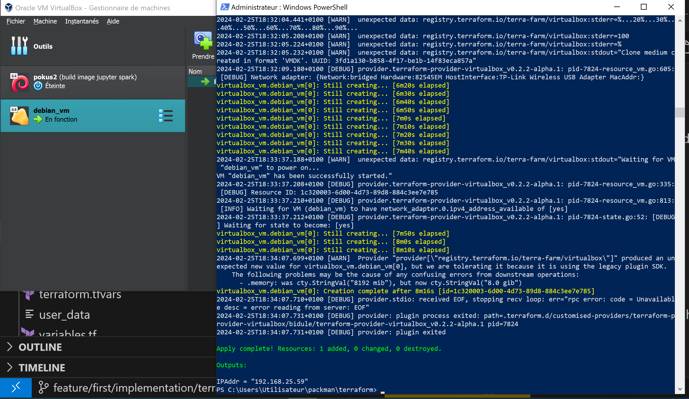
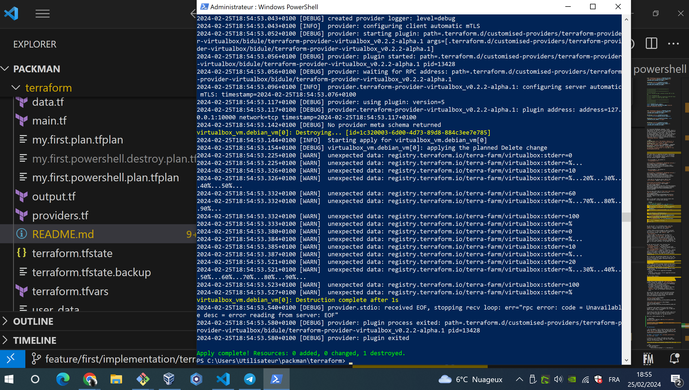

# The Terraform part

The work in this folder:

* proves that the [terra-faram/virtualbox](https://github.com/terra-farm/terraform-provider-virtualbox) terraform provider can work, but only with very limited features. It cannot be used for example, to provision a VM from a PXEless prepared virtual disk.

* It also is a base to analyze the design of that provider, and find improvements, for a complete new implementation of a terraform provider making it possible to fully manage virtualbox-based virtual machines.

This work also was the opportunity to definitely prove how to use the `dev_orverrides` terraform configuration, with today's recent versions of terraform.

That, as a preambule work for completely re-imlementing a virtualbox cloud provider and its associated terraform provider.

## Stack versions

* Git bash:

```bash
Utilisateur@Utilisateur-PC MINGW64 ~/packman (feature/first/implementation)
$ terraform version
Terraform v1.3.0
on windows_amd64

Your version of Terraform is out of date! The latest version
is 1.7.4. You can update by downloading from https://www.terraform.io/downloads.html

Utilisateur@Utilisateur-PC MINGW64 ~/packman (feature/first/implementation)
$ go version
go version go1.18.3 windows/amd64

Utilisateur@Utilisateur-PC MINGW64 ~/packman (feature/first/implementation)
$ VBoxManage --version
7.0.6r155176
```

* Powershell:

```Powershell
Windows PowerShell
Copyright (C) Microsoft Corporation. Tous droits réservés.

Testez le nouveau système multiplateforme PowerShell https://aka.ms/pscore6

PS C:\Users\Utilisateur> $Env:Path += ';C:\jibl_vbox\install'
PS C:\Users\Utilisateur> terraform version
Terraform v1.3.0
on windows_amd64

Your version of Terraform is out of date! The latest version
is 1.7.4. You can update by downloading from https://www.terraform.io/downloads.html
PS C:\Users\Utilisateur> go version
go version go1.18.3 windows/amd64
PS C:\Users\Utilisateur> VBoxManage --version
7.0.6r155176
PS C:\Users\Utilisateur>
```

## How to run

### Git bash for windows

* Locally Install the provider : 

```bash
# ~/.terraform.d/plugins/terraform.local/local/zabbix/1.0.0/linux_amd64/terraform-provider-zabbix_v1.0.0

export TF_PROVIDER_DESIRED_VERSION="0.2.2-alpha.1"

mkdir -p ./.terraform.d/customised-providers/terraform-provider-virtualbox/${TF_PROVIDER_DESIRED_VERSION}/

git clone git@github.com:terra-farm/terraform-provider-virtualbox.git ./.terraform.d/customised-providers/terraform-provider-virtualbox/${TF_PROVIDER_DESIRED_VERSION}/

cd ./.terraform.d/customised-providers/terraform-provider-virtualbox/${TF_PROVIDER_DESIRED_VERSION}/

git checkout "v${TF_PROVIDER_DESIRED_VERSION}"
rm -fr ./.git/

go build -o terraform-provider-virtualbox_v${TF_PROVIDER_DESIRED_VERSION}

mkdir -p ../bidule/

cp terraform-provider-virtualbox_v${TF_PROVIDER_DESIRED_VERSION} ../bidule/
rm terraform-provider-virtualbox_v${TF_PROVIDER_DESIRED_VERSION}


cd ../../../../


```

* Run:

```bash

export TF_CLI_CONFIG_FILE=$(pwd)/.dev.tfrc

export TF_LOG=debug

terraform validate
terraform fmt

terraform plan -out=my.first.plan.tfplan
terraform apply -auto-approve "my.first.plan.tfplan"


```

### Powershell

```Powershell
# ---
#  Note that on my machine, the [VBoxManage.exe] executable
#  file is located in 
#  the "C:\jibl_vbox\install" folder, where 
#  I installed VirtualBox. 
$Env:Path += ';C:\jibl_vbox\install'

$Env:TF_CLI_CONFIG_FILE = "./.dev.tfrc"
$Env:TF_LOG = "debug"

terraform validate
terraform fmt

terraform plan -out=my.first.powershell.plan.tfplan
terraform apply -auto-approve "my.first.powershell.plan.tfplan"

```

## Results

We have tested the latest release of the terrafarm virtualbox provider, the `0.2.2-alpha.1` release, both in Git bash for windows, and powershell, with a full build from source of the terraform provider.


### Deprecated version of terraform SDK

Running in debug mode could reveal that the provider implemntation uses a deprecated version of the terraform SDK, and we can read in the debug logs:

```bash
2024-02-24T20:56:46.798+0100 [WARN]  Provider "registry.terraform.io/terra-farm/virtualbox" produced an invalid plan for virtualbox_vm.debian_vm[0], but we are tolerating it because it is using the legacy plugin SDK.
    The following problems may be the cause of any confusing errors from downstream operations:
      - .status: planned value cty.StringVal("running") for a non-computed attribute
      - .network_adapter[0].device: planned value cty.StringVal("IntelPro1000MTServer") for a non-computed attribute
```

There is a major design issue, the terraform state contains a status that does not comply with reality: the `status` has `running` as a value, while the VM actually is not running.

About computed and non-computed attributes:
* https://discuss.hashicorp.com/t/computed-attributes-and-plan-modifiers/45830/3
* 

### Failure to create VM for powershell

```Powershell
virtualbox_vm.debian_vm[0]: Still creating... [9m43s elapsed]
virtualbox_vm.debian_vm[0]: Still creating... [9m53s elapsed]
virtualbox_vm.debian_vm[0]: Still creating... [10m3s elapsed]
virtualbox_vm.debian_vm[0]: Still creating... [10m13s elapsed]
virtualbox_vm.debian_vm[0]: Still creating... [10m23s elapsed]
2024-02-24T21:31:31.979+0100 [DEBUG] provider.terraform-provider-virtualbox_v0.2.2-alpha.1: pid-11644-utils.go:12: [ERROR] Create virtualbox VM debian_vm: exec: "false": executable file not found in %PATH%
2024-02-24T21:31:31.979+0100 [DEBUG] provider.terraform-provider-virtualbox_v0.2.2-alpha.1:
2024-02-24T21:31:32.003+0100 [ERROR] vertex "virtualbox_vm.debian_vm[0]" error: [ERROR] Create virtualbox VM debian_vm: exec: "false": executable file not found in %PATH%
╷
│ Error: [ERROR] Create virtualbox VM debian_vm: exec: "false": executable file not found in %PATH%
│
│
│   with virtualbox_vm.debian_vm[0],
│   on example.tf line 1, in resource "virtualbox_vm" "debian_vm":
│    1: resource "virtualbox_vm" "debian_vm" {
│
╵
2024-02-24T21:31:32.035+0100 [DEBUG] provider.stdio: received EOF, stopping recv loop: err="rpc error: code = Unavailable desc = error reading from server: EOF"
2024-02-24T21:31:32.061+0100 [DEBUG] provider: plugin process exited: path=.terraform.d/customised-providers/terraform-provider-virtualbox/bidule/terraform-provider-virtualbox_v0.2.2-alpha.1 pid=11644
2024-02-24T21:31:32.061+0100 [DEBUG] provider: plugin exited
PS C:\Users\Utilisateur\packman\terraform> VBoxManage --version
7.0.6r155176
PS C:\Users\Utilisateur\packman\terraform> go version
go version go1.18.3 windows/amd64
```

The exact golang instrcution which thros the error, is line 236 of the `resource_vm.go` source code file, and this is the instruction which invokes the VirtualBox VBoxManage executable file:

```Golang
	// Create VM instance
	name := d.Get("name").(string)
	vm, err := vbox.CreateMachine(name, machineFolder)
	if err != nil {
		return errLogf("Create virtualbox VM %s: %v\n", name, err)
	}
```

There, the `vbox.CreateMachine(name, machineFolder)` function comes from https://github.com/terra-farm/go-virtualbox, where I searched how the VboxManage executable file is looked up. I found [this line](https://github.com/terra-farm/go-virtualbox/blob/5b7d1140508ec16a3756bec4c04b5d28db6cae41/vbmgt.go#L49C22-L49C39), which suggests that the PATH env var is not set, but instead i could use the `VBOX_INSTALL_PATH` env var.

That's why I tried again executing my terraform like this:

```Powershell
$Env:VBOX_INSTALL_PATH = "C:\jibl_vbox\install"

$Env:TF_CLI_CONFIG_FILE = "./.dev.tfrc"
$Env:TF_LOG = "debug"

terraform validate
terraform fmt

terraform plan -out="my.first.powershell.plan.tfplan"
terraform apply -auto-approve "my.first.powershell.plan.tfplan"
```

Finally, I found this issue showing others have experienced the same issue and solved it the same way, except that the `VBOX_INSTALL_PATH` has to be set as a system env var globally for windows, and the computer needs to be restarted: https://github.com/terra-farm/terraform-provider-virtualbox/issues/101

In my case, I didn't have to create the System wide env var, setting it in the Powershell session ws enough, and the VM is indeed created, yet, I still get an error to investigate :

```Powershell
virtualbox_vm.debian_vm[0]: Still creating... [5m50s elapsed]
virtualbox_vm.debian_vm[0]: Still creating... [6m0s elapsed]
2024-02-24T22:40:27.122+0100 [WARN]  unexpected data: registry.terraform.io/terra-farm/virtualbox:stdout="Virtual machine 'debian_vm' is created and registered.
UUID: 7b4ad45e-6929-4241-8b56-3631debdf052
Settings file: 'C:\Users\Utilisateur\.terraform\virtualbox\machine\debian_vm\debian_vm.vbox'"
2024-02-24T22:40:27.255+0100 [WARN]  unexpected data: registry.terraform.io/terra-farm/virtualbox:stderr=0
2024-02-24T22:40:27.255+0100 [WARN]  unexpected data: registry.terraform.io/terra-farm/virtualbox:stderr=%...
virtualbox_vm.debian_vm[0]: Still creating... [6m10s elapsed]
virtualbox_vm.debian_vm[0]: Still creating... [6m20s elapsed]
2024-02-24T22:40:46.849+0100 [WARN]  unexpected data: registry.terraform.io/terra-farm/virtualbox:stderr=10
2024-02-24T22:40:46.849+0100 [WARN]  unexpected data: registry.terraform.io/terra-farm/virtualbox:stderr=%...20%...30%...40%...50%...60%...70%...80%...90%...
2024-02-24T22:40:47.274+0100 [WARN]  unexpected data: registry.terraform.io/terra-farm/virtualbox:stderr=100
2024-02-24T22:40:47.275+0100 [WARN]  unexpected data: registry.terraform.io/terra-farm/virtualbox:stderr=%
2024-02-24T22:40:47.296+0100 [WARN]  unexpected data: registry.terraform.io/terra-farm/virtualbox:stdout="Clone medium created in format 'VMDK'. UUID: 46c04b6b-e008-4b46-9877-55a3f4abcdb3"
2024-02-24T22:40:47.417+0100 [WARN]  unexpected data: registry.terraform.io/terra-farm/virtualbox:stderr=0
2024-02-24T22:40:47.418+0100 [WARN]  unexpected data: registry.terraform.io/terra-farm/virtualbox:stderr=%...
2024-02-24T22:40:47.518+0100 [WARN]  unexpected data: registry.terraform.io/terra-farm/virtualbox:stderr=10
2024-02-24T22:40:47.518+0100 [WARN]  unexpected data: registry.terraform.io/terra-farm/virtualbox:stderr=%...20%...30%...40%...50%...60
2024-02-24T22:40:47.522+0100 [WARN]  unexpected data: registry.terraform.io/terra-farm/virtualbox:stderr=%...70%...80%...90%...
2024-02-24T22:40:47.811+0100 [WARN]  unexpected data: registry.terraform.io/terra-farm/virtualbox:stderr=100
2024-02-24T22:40:47.812+0100 [WARN]  unexpected data: registry.terraform.io/terra-farm/virtualbox:stderr=%
2024-02-24T22:40:47.817+0100 [WARN]  unexpected data: registry.terraform.io/terra-farm/virtualbox:stdout="Clone medium created in format 'VMDK'. UUID: 0ef65129-ca6b-48e2-b70a-70c151235381"
2024-02-24T22:40:49.587+0100 [DEBUG] provider.terraform-provider-virtualbox_v0.2.2-alpha.1: pid-12188-resource_vm.go:605: [DEBUG] Network adapter: {Network: Hardware:82545EM HostInterface: MacAddr:}
2024-02-24T22:40:50.447+0100 [WARN]  unexpected data: registry.terraform.io/terra-farm/virtualbox:stderr=VBoxManage.exe
2024-02-24T22:40:50.447+0100 [WARN]  unexpected data: registry.terraform.io/terra-farm/virtualbox:stderr=": error: Invalid type '' specfied for NIC 1"
2024-02-24T22:40:50.475+0100 [DEBUG] provider.terraform-provider-virtualbox_v0.2.2-alpha.1: pid-12188-utils.go:12: [ERROR] Setup VM properties: exit status 1
2024-02-24T22:40:51.235+0100 [ERROR] vertex "virtualbox_vm.debian_vm[0]" error: [ERROR] Setup VM properties: exit status 1
╷
│ Error: [ERROR] Setup VM properties: exit status 1
│
│   with virtualbox_vm.debian_vm[0],
│   on example.tf line 1, in resource "virtualbox_vm" "debian_vm":
│    1: resource "virtualbox_vm" "debian_vm" {
│
╵
2024-02-24T22:40:51.680+0100 [DEBUG] provider.stdio: received EOF, stopping recv loop: err="rpc error: code = Unavailable desc = error reading from server: EOF"
2024-02-24T22:40:51.710+0100 [DEBUG] provider: plugin process exited: path=.terraform.d/customised-providers/terraform-provider-virtualbox/bidule/terraform-provider-virtualbox_v0.2.2-alpha.1 pid=12188
2024-02-24T22:40:51.710+0100 [DEBUG] provider: plugin exited
PS C:\Users\Utilisateur\packman\terraform>
```

The above error was caused by an error in my terraform configuration: I specified `bridge`, instead of `bridged`, for the VM's network interface `type` :

```Hcl
  network_adapter {
    # type           = "hostonly"
    type = "bridged"
    # host_interface = "vboxnet1"
  }
```

So I manually deleted the created VM, using VirtualBox WebUI, which left the created VMDK disk intact, and I ran again the terraform:

```Powershell
$Env:VBOX_INSTALL_PATH = "C:\jibl_vbox\install"

$Env:TF_CLI_CONFIG_FILE = "./.dev.tfrc"
$Env:TF_LOG = "debug"

terraform validate
terraform fmt

terraform plan -out="my.first.powershell.plan.tfplan"
terraform apply -auto-approve "my.first.powershell.plan.tfplan"
```

I then get a new error:

```Powershell
2024-02-25T08:04:56.861+0100 [WARN]  unexpected data: registry.terraform.io/terra-farm/virtualbox:stdout="Clone medium created in format 'VMDK'. UUID: 550db462-045d-4191-ade8-cb934ba2cb30"
virtualbox_vm.debian_vm[0]: Still creating... [6m0s elapsed]
virtualbox_vm.debian_vm[0]: Still creating... [6m10s elapsed]
2024-02-25T08:05:20.477+0100 [WARN]  unexpected data: registry.terraform.io/terra-farm/virtualbox:stdout="Waiting for VM "debian_vm" to power on...
VM "debian_vm" has been successfully started."
2024-02-25T08:05:20.484+0100 [DEBUG] provider.terraform-provider-virtualbox_v0.2.2-alpha.1: pid-14560-resource_vm.go:335: [DEBUG] Resource ID: 98dfa8e8-f0f5-4635-b309-e8cf1beb54d0
2024-02-25T08:05:20.589+0100 [DEBUG] provider.terraform-provider-virtualbox_v0.2.2-alpha.1: pid-14560-utils.go:12: [ERROR] can't convert vbox network to terraform data: No match with get guestproperty output
2024-02-25T08:05:20.609+0100 [ERROR] vertex "virtualbox_vm.debian_vm[0]" error: [ERROR] can't convert vbox network to terraform data: No match with get guestproperty output
╷
│ Error: [ERROR] can't convert vbox network to terraform data: No match with get guestproperty output
│
│   with virtualbox_vm.debian_vm[0],
│   on main.tf line 1, in resource "virtualbox_vm" "debian_vm":
│    1: resource "virtualbox_vm" "debian_vm" {
│
╵
2024-02-25T08:05:20.629+0100 [DEBUG] provider.stdio: received EOF, stopping recv loop: err="rpc error: code = Unavailable desc = error reading from server: EOF"
2024-02-25T08:05:20.649+0100 [DEBUG] provider: plugin process exited: path=.terraform.d/customised-providers/terraform-provider-virtualbox/bidule/terraform-provider-virtualbox_v0.2.2-alpha.1 pid=14560
2024-02-25T08:05:20.649+0100 [DEBUG] provider: plugin exited
PS C:\Users\Utilisateur\packman\terraform>
```

Working on this new issue:
* I very quickly found an issue opened about the exact same error: https://github.com/terra-farm/terraform-provider-virtualbox/issues/138
* I then started to search which part of the terrafarm golang source code was throwing this error:
  * I found one point in the [`go-virtualbox`](https://github.com/terra-farm/go-virtualbox) dependency of the terraform provider, which deals with VirtualBox VM guest properties: https://github.com/search?q=repo%3Aterra-farm%2Fgo-virtualbox+No+match+with+get+guestproperty+output&type=code , https://github.com/terra-farm/go-virtualbox/blob/5b7d1140508ec16a3756bec4c04b5d28db6cae41/guestprop.go#L12
  * cccc

One of the Idea that I to fix the issue, is to chack that the network interface type matches one that is available, on my own machine.

Using the VBoxManage executable, I listed all the network interfaces types available on my machine using the `VBoxManage list bridgedifs` command:

```bash
$ VBoxManage list bridgedifs
Name:            TP-Link Wireless USB Adapter
GUID:            3f7ac2f7-d65b-4f03-b195-1fe59b66a8cd
DHCP:            Enabled
IPAddress:       192.168.25.236
NetworkMask:     255.255.255.0
IPV6Address:     fe80::32dc:696:641b:ab38
IPV6NetworkMaskPrefixLength: 64
HardwareAddress: b4:b0:24:d5:03:8c
MediumType:      Ethernet
Wireless:        Yes
Status:          Up
VBoxNetworkName: HostInterfaceNetworking-TP-Link Wireless USB Adapter

Name:            Intel(R) Ethernet Connection I217-LM
GUID:            ebd8af8d-b6f9-4af1-b30e-0154286bcc25
DHCP:            Enabled
IPAddress:       169.254.153.110
NetworkMask:     255.255.0.0
IPV6Address:     fe80::4df0:28ee:e94:169d
IPV6NetworkMaskPrefixLength: 64
HardwareAddress: b8:ca:3a:a9:d0:1e
MediumType:      Ethernet
Wireless:        No
Status:          Down
VBoxNetworkName: HostInterfaceNetworking-Intel(R) Ethernet Connection I217-LM

Name:            Npcap Loopback Adapter
GUID:            581aca5e-68da-4c96-ab11-cf7a05f7f6c8
DHCP:            Enabled
IPAddress:       169.254.92.195
NetworkMask:     255.255.0.0
IPV6Address:     fe80::45fc:6677:970a:1773
IPV6NetworkMaskPrefixLength: 64
HardwareAddress: 02:00:4c:4f:4f:50
MediumType:      Ethernet
Wireless:        No
Status:          Up
VBoxNetworkName: HostInterfaceNetworking-Npcap Loopback Adapter

```

So, i should use one of the values displayed with the `VBoxNetworkName` field. Here I will use the `HostInterfaceNetworking-TP-Link Wireless USB Adapter` one.

After this change, I again ran my terraform with exactly the same commands, resulting in a new error, so my previous error is solved, and the new error is about the fact that the host_interface property is not set:

```Powershell
2024-02-25T12:46:56.183+0100 [WARN]  unexpected data: registry.terraform.io/terra-farm/virtualbox:stderr=%
2024-02-25T12:46:56.184+0100 [WARN]  unexpected data: registry.terraform.io/terra-farm/virtualbox:stdout="Clone medium created in format 'VMDK'. UUID: 36e4f3a5-e20a-4b63-bebf-13e96a2b5c22"
virtualbox_vm.debian_vm[0]: Still creating... [3m50s elapsed]
2024-02-25T12:46:59.279+0100 [DEBUG] provider.terraform-provider-virtualbox_v0.2.2-alpha.1: pid-1828-utils.go:12: [ERROR] Converting Terraform data to VM properties: 1 error occurred:
2024-02-25T12:46:59.279+0100 [DEBUG] provider.terraform-provider-virtualbox_v0.2.2-alpha.1:     * 'host_interface' property not set for '#0' network adapter
2024-02-25T12:46:59.288+0100 [DEBUG] provider.terraform-provider-virtualbox_v0.2.2-alpha.1:
2024-02-25T12:46:59.288+0100 [DEBUG] provider.terraform-provider-virtualbox_v0.2.2-alpha.1:
2024-02-25T12:46:59.323+0100 [ERROR] vertex "virtualbox_vm.debian_vm[0]" error: [ERROR] Converting Terraform data to VM properties: 1 error occurred:
        * 'host_interface' property not set for '#0' network adapter
╷
│ Error: [ERROR] Converting Terraform data to VM properties: 1 error occurred:
│       * 'host_interface' property not set for '#0' network adapter
│
│
│
│   with virtualbox_vm.debian_vm[0],
│   on main.tf line 1, in resource "virtualbox_vm" "debian_vm":
│    1: resource "virtualbox_vm" "debian_vm" {
│
╵
2024-02-25T12:46:59.397+0100 [DEBUG] provider.stdio: received EOF, stopping recv loop: err="rpc error: code = Unavailable desc = error reading from server: EOF"
2024-02-25T12:46:59.435+0100 [DEBUG] provider: plugin process exited: path=.terraform.d/customised-providers/terraform-provider-virtualbox/bidule/terraform-provider-virtualbox_v0.2.2-alpha.1 pid=1828
2024-02-25T12:46:59.435+0100 [DEBUG] provider: plugin exited
PS C:\Users\Utilisateur\packman\terraform>
```

As of [this page of the `terra-farm/terraform-provider-virtualbox`](https://terra-farm.github.io/provider-virtualbox/reference/resource_vm.html), the `host_interface`, if set, should be set to the name of the linux network interface inside the VM, so i will set it to `enp3s0`, a default network interface I have very often encountered as a [Linux predictable network interface name](https://wiki.debian.org/NetworkInterfaceNames)

Now that I set the host_interface property, I do get an error about the value I set to the `device` property:

```Powershell
2024-02-25T13:53:35.549+0100 [WARN]  unexpected data: registry.terraform.io/terra-farm/virtualbox:stderr=%...
2024-02-25T13:53:35.878+0100 [WARN]  unexpected data: registry.terraform.io/terra-farm/virtualbox:stderr=10
2024-02-25T13:53:35.878+0100 [WARN]  unexpected data: registry.terraform.io/terra-farm/virtualbox:stderr=%...20%...30%...40%...50%...60%...70%...80%...90%...
2024-02-25T13:53:36.573+0100 [WARN]  unexpected data: registry.terraform.io/terra-farm/virtualbox:stderr=100
2024-02-25T13:53:36.573+0100 [WARN]  unexpected data: registry.terraform.io/terra-farm/virtualbox:stderr=%
2024-02-25T13:53:36.577+0100 [WARN]  unexpected data: registry.terraform.io/terra-farm/virtualbox:stdout="Clone medium created in format 'VMDK'. UUID: 9ea82912-93b6-4810-b734-d80b98d36638"
virtualbox_vm.debian_vm[0]: Still creating... [4m0s elapsed]
2024-02-25T13:53:37.353+0100 [DEBUG] provider.terraform-provider-virtualbox_v0.2.2-alpha.1: pid-4708-utils.go:12: [ERROR] Converting Terraform data to VM properties: 1 error occurred:
2024-02-25T13:53:37.353+0100 [DEBUG] provider.terraform-provider-virtualbox_v0.2.2-alpha.1:     * Invalid virtual network device: HostInterfaceNetworking-TP-Link Wireless USB Adapter
2024-02-25T13:53:37.356+0100 [DEBUG] provider.terraform-provider-virtualbox_v0.2.2-alpha.1:
2024-02-25T13:53:37.364+0100 [DEBUG] provider.terraform-provider-virtualbox_v0.2.2-alpha.1:
2024-02-25T13:53:37.388+0100 [ERROR] vertex "virtualbox_vm.debian_vm[0]" error: [ERROR] Converting Terraform data to VM properties: 1 error occurred:
        * Invalid virtual network device: HostInterfaceNetworking-TP-Link Wireless USB Adapter
╷
│ Error: [ERROR] Converting Terraform data to VM properties: 1 error occurred:
│       * Invalid virtual network device: HostInterfaceNetworking-TP-Link Wireless USB Adapter
│
│
│
│   with virtualbox_vm.debian_vm[0],
│   on main.tf line 1, in resource "virtualbox_vm" "debian_vm":
│    1: resource "virtualbox_vm" "debian_vm" {
│
╵
2024-02-25T13:53:37.425+0100 [DEBUG] provider.stdio: received EOF, stopping recv loop: err="rpc error: code = Unavailable desc = error reading from server: EOF"
2024-02-25T13:53:37.461+0100 [DEBUG] provider: plugin process exited: path=.terraform.d/customised-providers/terraform-provider-virtualbox/bidule/terraform-provider-virtualbox_v0.2.2-alpha.1 pid=4708
2024-02-25T13:53:37.461+0100 [DEBUG] provider: plugin exited
PS C:\Users\Utilisateur\packman\terraform>
```

I then tired changing the value of the `device` property to `TP-Link Wireless USB Adapter`, instead of `HostInterfaceNetworking-TP-Link Wireless USB Adapter`. It resulted in the same error:

```Powershell
2024-02-25T14:17:45.947+0100 [WARN]  unexpected data: registry.terraform.io/terra-farm/virtualbox:stderr=10
2024-02-25T14:17:45.955+0100 [WARN]  unexpected data: registry.terraform.io/terra-farm/virtualbox:stderr=%...20%...30%...40%...50%...60%...70%...80%...90%...
2024-02-25T14:17:45.969+0100 [WARN]  unexpected data: registry.terraform.io/terra-farm/virtualbox:stderr=100%
2024-02-25T14:17:45.972+0100 [WARN]  unexpected data: registry.terraform.io/terra-farm/virtualbox:stdout="Clone medium created in format 'VMDK'. UUID: 194b233e-74dd-47c6-9cde-9a97954dcae0"
2024-02-25T14:17:49.441+0100 [DEBUG] provider.terraform-provider-virtualbox_v0.2.2-alpha.1: pid-4760-utils.go:12: [ERROR] Converting Terraform data to VM properties: 1 error occurred:
2024-02-25T14:17:49.442+0100 [DEBUG] provider.terraform-provider-virtualbox_v0.2.2-alpha.1:     * Invalid virtual network device: TP-Link Wireless USB Adapter
2024-02-25T14:17:49.446+0100 [DEBUG] provider.terraform-provider-virtualbox_v0.2.2-alpha.1:
2024-02-25T14:17:49.454+0100 [DEBUG] provider.terraform-provider-virtualbox_v0.2.2-alpha.1:
2024-02-25T14:17:49.847+0100 [ERROR] vertex "virtualbox_vm.debian_vm[0]" error: [ERROR] Converting Terraform data to VM properties: 1 error occurred:
        * Invalid virtual network device: TP-Link Wireless USB Adapter
╷
│ Error: [ERROR] Converting Terraform data to VM properties: 1 error occurred:
│       * Invalid virtual network device: TP-Link Wireless USB Adapter
│
│
│
│   with virtualbox_vm.debian_vm[0],
│   on main.tf line 1, in resource "virtualbox_vm" "debian_vm":
│    1: resource "virtualbox_vm" "debian_vm" {
│
╵
2024-02-25T14:17:50.290+0100 [DEBUG] provider.stdio: received EOF, stopping recv loop: err="rpc error: code = Unavailable desc = error reading from server: EOF"
2024-02-25T14:17:50.324+0100 [DEBUG] provider: plugin process exited: path=.terraform.d/customised-providers/terraform-provider-virtualbox/bidule/terraform-provider-virtualbox_v0.2.2-alpha.1 pid=4760
2024-02-25T14:17:50.325+0100 [DEBUG] provider: plugin exited
PS C:\Users\Utilisateur\packman\terraform>
```

After those tests, I know that :
* Either the `terra-farm` golang source (the provider or the `terra-farm/go-virutalbox` module), is wrong about how to set the network device in VirtualBox, to the value I feed to the `device` property
* Or the `VBoxManage` executable, refuses the values I set for the `device` property

To check that, I will do 2 things:
* I will search in the source code of the `terra-farm/go-virutalbox` module, where and how the `device` property is used to set the network interface device with `VBoxManage`  
* I will write a shell script of `VBoxManage` commands, which completes the setup of the created VirutalBox VM:
  * At the point where my terraform fails with the above described error, a VirtualBox VM stil is indeed created, 
  * with the desired disk attached to it, and the deisred CPU numbers, and RAM memory amount.
  * But the network configuration is not complete: my VBoxMAnage commands will complete that machine configuration.
  * Note I already manually completed the network configuration, and start the VM, and i could login the VM using linux username and password `vagrant` (as username) / `vagrant` (as password). I finally executed the `ip addr` command, to check if an IP Address successfully is granted to the network interface, and that's indeed the case, plus on the Linux network interface I specified as value of the `host_interface` property, the _Linux predictable network interface name_, `enp0s3`. See the screenshot below.


I then:
* commented the `device` property inmy terraform recipe, and ran again my terraform
* I ended up with a different error, without any error mesage infos, of my terraform, and the created VM does ahve exactly the settings I want, with the NIC1 virtual network adapter enabled and the host adapter set to my host computer "`Wireless network adapter`. 
* Now, a question rose: 
  * I did comment the `device` property, which was set to the name of the ``
  * I did set the `host_interface` to the name of the guest OS Linux interrface I desired
  * So the terraform provider could not get hte information of which network adapter to use on the host, from my terraform code. It could only choose the only one which is chosen by default by VirtualBox
  * And As I ran `VBoxManage list bridgedifs --long`, I would check that only 3 network interfaces are listed on my hardware host machine, and among the 3 ony one has status UP. 
  * That's why I wondered: what if there are not one, but 2 network interfaces on my host machine, and I want to force the VM to use one, and not the other (the default one)? How do I do that ?
  * So I ran again my terraform, with a second host network interface activated, as shown by the below output of the `VBoxManage list bridgedifs --long`

```bash
$ VBoxManage list bridgedifs --long
Name:            TP-Link Wireless USB Adapter
GUID:            3f7ac2f7-d65b-4f03-b195-1fe59b66a8cd
DHCP:            Enabled
IPAddress:       192.168.25.236
NetworkMask:     255.255.255.0
IPV6Address:     fe80::32dc:696:641b:ab38
IPV6NetworkMaskPrefixLength: 64
HardwareAddress: b4:b0:24:d5:03:8c
MediumType:      Ethernet
Wireless:        Yes
Status:          Up
VBoxNetworkName: HostInterfaceNetworking-TP-Link Wireless USB Adapter

Name:            Intel(R) Ethernet Connection I217-LM
GUID:            ebd8af8d-b6f9-4af1-b30e-0154286bcc25
DHCP:            Enabled
IPAddress:       192.168.1.102
NetworkMask:     255.255.255.0
IPV6Address:     fe80::4df0:28ee:e94:169d
IPV6NetworkMaskPrefixLength: 64
HardwareAddress: b8:ca:3a:a9:d0:1e
MediumType:      Ethernet
Wireless:        No
Status:          Up
VBoxNetworkName: HostInterfaceNetworking-Intel(R) Ethernet Connection I217-LM

Name:            Npcap Loopback Adapter
GUID:            581aca5e-68da-4c96-ab11-cf7a05f7f6c8
DHCP:            Enabled
IPAddress:       169.254.92.195
NetworkMask:     255.255.0.0
IPV6Address:     fe80::45fc:6677:970a:1773
IPV6NetworkMaskPrefixLength: 64
HardwareAddress: 02:00:4c:4f:4f:50
MediumType:      Ethernet
Wireless:        No
Status:          Up
VBoxNetworkName: HostInterfaceNetworking-Npcap Loopback Adapter

```

The result, as I expected, is a created VM, with host network adapter set to the `TP-Link Wireless USB Adapter`, which can only be the default adapter. I kept the exact code to reproduce that behavior, in the [`ROOT_OF_GIT_REPO/terraform.default.vbox.host.net.adapter`](../terraform.default.vbox.host.net.adapter) folder, so you can fully reproduce that behavior.

So, what if now I want my VM virtual NIC to use as host network adapter, the `Intel(R) Ethernet Connection I217-LM`, instead of the `TP-Link Wireless USB Adapter` ? It would not be possible with the terra-farm's terraform provider.

So indeed, the is a problem, an Issue. So it's time to dive into the Golang source code, and to run `VBoxManage` command in the shell, to check.

First, from the created VM, I will run VBoxManage commands to make sure what exact command is able to change the selected host network adapter, chaging it to the `Intel(R) Ethernet Connection I217-LM`, instead of the `TP-Link Wireless USB Adapter`:

```bash

# >>>>>>>>>>>>>>>> # >>>>>>>>>>>>>>>> # >>>>>>>>>>>>>>>>
# >>>>>>>>>>>>>>>> # >>>>>>>>>>>>>>>> # >>>>>>>>>>>>>>>>
# >>>>>> First we modify the Host Adapter of the NIC 1
# >>>>>> So that it changes, from
# >>>>>> "TP-Link Wireless USB Adapter", to 
# >>>>>> "Intel(R) Ethernet Connection I217-LM"
# >>>>>>>>>>>>>>>> # >>>>>>>>>>>>>>>> # >>>>>>>>>>>>>>>>
# >>>>>>>>>>>>>>>> # >>>>>>>>>>>>>>>> # >>>>>>>>>>>>>>>>

# ---
# 1./ Find the VM's UUID, from its name

export CREATED_VM_NAME="debian_vm"

export CREATED_VM_UUID=$(VBoxManage list vms | grep ${CREATED_VM_NAME} | awk -F '{' '{ print $2}' | awk -F '}' '{ print $1}')

echo " >>> CREATED_VM_UUID=[${CREATED_VM_UUID}]"


export CREATED_VM_NIC_INDEX=1
# ---
#  To get the value of
#  "DESIRED_HOST_NETWORK_INT_NAME", run : 
#  "VBoxManage list bridgedifs --long" 
# -
# 
export DESIRED_HOST_NETWORK_INT_NAME="HostInterfaceNetworking-TP-Link Wireless USB Adapter"
export DESIRED_HOST_NETWORK_INT_NAME="TP-Link Wireless USB Adapter"

export DESIRED_HOST_NETWORK_INT_NAME="HostInterfaceNetworking-Intel(R) Ethernet Connection I217-LM"
export DESIRED_HOST_NETWORK_INT_NAME="Intel(R) Ethernet Connection I217-LM"


echo "VBoxManage modifyvm ${CREATED_VM_UUID} --bridge-adapter${CREATED_VM_NIC_INDEX}=\"${DESIRED_HOST_NETWORK_INT_NAME}\""

VBoxManage modifyvm ${CREATED_VM_UUID} --bridge-adapter${CREATED_VM_NIC_INDEX}="${DESIRED_HOST_NETWORK_INT_NAME}"


# >>>>>>>>>>>>>>>> # >>>>>>>>>>>>>>>> # >>>>>>>>>>>>>>>>
# >>>>>>>>>>>>>>>> # >>>>>>>>>>>>>>>> # >>>>>>>>>>>>>>>>
# >>>>>> Second we add a second virtual NIC to the VM,
# >>>>>> assigning the 
# >>>>>> "Intel(R) Ethernet Connection I217-LM" Host 
# >>>>>> Adapter to that new NIC, NIC2
# >>>>>> 
# >>>>>>>>>>>>>>>> # >>>>>>>>>>>>>>>> # >>>>>>>>>>>>>>>>
# >>>>>>>>>>>>>>>> # >>>>>>>>>>>>>>>> # >>>>>>>>>>>>>>>>
export CREATED_VM_NIC_INDEX=2
export DESIRED_HOST_NETWORK_INT_NAME="Intel(R) Ethernet Connection I217-LM"


echo "VBoxManage modifyvm ${CREATED_VM_UUID} --bridge-adapter${CREATED_VM_NIC_INDEX}=\"${DESIRED_HOST_NETWORK_INT_NAME}\""

VBoxManage modifyvm ${CREATED_VM_UUID} --cable-connected${CREATED_VM_NIC_INDEX}=on

VBoxManage modifyvm ${CREATED_VM_UUID} --nic${CREATED_VM_NIC_INDEX}="bridged"


VBoxManage modifyvm ${CREATED_VM_UUID} --bridge-adapter${CREATED_VM_NIC_INDEX}="${DESIRED_HOST_NETWORK_INT_NAME}"

```

As I executed VBoxManage commands, I once experienced one special error being thrown, which is interesting to note, for a further re-implementation of the virtualbox cloud provider, that will be terraform compatible. This error, might be caused by one VBoxManage command which has not completed its work, and the next already starting (VIrtualBox locks the states of a machine everytime we execute a `VBoxManage modifyvm` command):

```bash
VBoxManage.exe: error: The machine 'debian_vm' is already locked for a session (or being unlocked)
VBoxManage.exe: error: Details: code VBOX_E_INVALID_OBJECT_STATE (0x80bb0007), component MachineWrap, interface IMachine, callee IUnknown
VBoxManage.exe: error: Context: "LockMachine(a->session, LockType_Write)" at line 641 of file VBoxManageModifyVM.cpp
```

Note that there is something extremely interesting, to check: from VirtualBox version 6, to VirtualBox version 7, the VBoxManage command option to change the host network adapter, changed.

* For VirtualBox 6, the option is `--bridgeadapter<1-N>`:

[](https://docs.oracle.com/en/virtualization/virtualbox/6.0/user/vboxmanage-modifyvm.html)

* For VirtualBox 7, the option is  `--bridge-adapter<1-N>`:

[](https://docs.oracle.com/en/virtualization/virtualbox/7.0/user/vboxmanage.html#vboxmanage-modifyvm-general)

* And look at the golang source code of the `go-virtualbox` module, from `terra-farm`:

[](https://github.com/terra-farm/go-virtualbox/blob/5b7d1140508ec16a3756bec4c04b5d28db6cae41/machine.go#L209)

You can even check that in [that exact same source code file](https://github.com/terra-farm/go-virtualbox/blob/5b7d1140508ec16a3756bec4c04b5d28db6cae41/machine.go#L209), there is zero usage of the `nic.Device` property.

Here is the exact code of the function which sets the created VM 's virtual NIC settings:

```Golang
// SetNIC set the n-th NIC.
func (m *Machine) SetNIC(n int, nic NIC) error {
	args := []string{"modifyvm", m.Name,
		fmt.Sprintf("--nic%d", n), string(nic.Network),
		fmt.Sprintf("--nictype%d", n), string(nic.Hardware),
		fmt.Sprintf("--cableconnected%d", n), "on",
	}

	if nic.Network == NICNetHostonly {
		args = append(args, fmt.Sprintf("--hostonlyadapter%d", n), nic.HostInterface)
	} else if nic.Network == NICNetBridged {
		args = append(args, fmt.Sprintf("--bridgeadapter%d", n), nic.HostInterface)
	}
	_, _, err := Manage().run(args...)
	return err
}
```

As you can see, it is extremely basic, the only thing it does, is using only one `VBoxManage modifyvm` command, with only one option:

* which could no way be enough to take in account the value of 2 or more configuration properties in the terraform recipe, like `device`, and `host_interface`
* Plus it does not make any sens to give to a property named `host_interface`, the name of a network interface in the _guest_ OS inside the VM. SO I was worng and it was not even making sense, to try and assign to the `host_interface` property, the value of the _Linux network interface predictable name_ of the host interface, of the Guest OS, in the VM.

As you can see as well, this function uses `VirtualBox` version `6`, option syntax `--bridgeadapter<1-N>`, and should not work with `VirtualBox` version `7`, where the option syntax is now `--bridge-adapter<1-N>`, and not `--bridgeadapter<1-N>` anymore. I hereafter, checked that it still works, without any tweak, certainly because VirtualBox 7 was designed by higher class enigineers at Oracle, who made the option backward compatible. 

But in the end, the breaking change will rise, and the terraform provider must take in account this, by having a strategy to support different versions of VirtualBox explicitly:
* For example, the terraform provider should have a new configuration parameter, the major version of VirtualBox. 
* Also, the terraform provider should include smart error management to detect the underlying version of VirtualBox, and state early, if it is supported by the version of the terraform provider. 
* Additionnaly, the teraform provider Release notes, should include :
  * the full list of all supported VirtualBOx releases
  * The full relase notes, of all supported versions of VirtualBox releases.

For all those reasons:
* That is why is finally changed the value of `host_interface`, to the value of the desired Host network Adapter, i.e. in my case `Intel(R) Ethernet Connection I217-LM` or `TP-Link Wireless USB Adapter`
* That also is why I think the `host_interface` property shoudl be renamed to `host_network_adpater`:
  * to match the terminology used by the VBoxManage executable, both in version 6 and 7.
  * to match the terminology displayed by VirtualBox, although I want to check if the term `adapter` will be displayed, instead of the `interface` term, by VirtualBox installed onto a Linux.

And with all this work, now the terraform provider does create a VM with the exact Desired settings, with a VM actually up and running, and completes terraform execution without error:




I sometimes hear people discussing what being a Devops is, and that, is a pragmatic way to demo you what it means, to be a devops:

If we have to dive into the code, we will, and if we need to change the ocde so that the infrastructure will work, as we decide, oh  you bet we will.

Now let's neatly destroy our VM:

```Powershell
terraform plan -destroy -out="my.first.powershell.destroy.plan.tfplan"

terraform apply -auto-approve "my.first.powershell.destroy.plan.tfplan"
```




Finally, I tested creating the same VM, but with 2 network interfaecs, instead of just 1:

* The first virtual NIC of my VM is set to use my other host network adapter (a LAN Network with DHCP on my personal copper cable router).
* The second virtual NIC of my VM is set to use my TP Link Wifi Adapter as host network adapter
* I also tested the other way around, with my TP Link USB WIFI Adapter, for the first virtual NIC of my network adapter, and in both cases, he result is the same: The terraform waits forever that an ip address becomes available, and the VM is nevertheless properly created. That is definitely not satisfying, and the rprovider does not suport multiple virtual NICs per VMs. See the below logs showing in debug mode what the provider does, in this case:

```bash
PS C:\Users\Utilisateur\packman\terraform> terraform apply -auto-approve "my.first.powershell.plan.tfplan"
2024-02-25T19:29:18.777+0100 [INFO]  Terraform version: 1.3.0
2024-02-25T19:29:18.796+0100 [DEBUG] using github.com/hashicorp/go-tfe v1.9.0
2024-02-25T19:29:18.798+0100 [DEBUG] using github.com/hashicorp/hcl/v2 v2.14.0
2024-02-25T19:29:18.802+0100 [DEBUG] using github.com/hashicorp/terraform-config-inspect v0.0.0-20210209133302-4fd17a0faac2
2024-02-25T19:29:18.802+0100 [DEBUG] using github.com/hashicorp/terraform-svchost v0.0.0-20200729002733-f050f53b9734
2024-02-25T19:29:18.803+0100 [DEBUG] using github.com/zclconf/go-cty v1.11.0
2024-02-25T19:29:18.803+0100 [INFO]  Go runtime version: go1.19.1
2024-02-25T19:29:18.804+0100 [INFO]  CLI args: []string{"C:\\ProgramData\\chocolatey\\lib\\terraform\\tools\\terraform.exe", "apply", "-auto-approve", "my.first.powershell.plan.tfplan"}
2024-02-25T19:29:18.804+0100 [DEBUG] Attempting to open CLI config file: ./.dev.tfrc
2024-02-25T19:29:18.805+0100 [INFO]  Loading CLI configuration from ./.dev.tfrc
2024-02-25T19:29:18.805+0100 [DEBUG] Not reading CLI config directory because config location is overridden by environment variable
2024-02-25T19:29:18.808+0100 [DEBUG] Explicit provider installation configuration is set
2024-02-25T19:29:18.808+0100 [INFO]  CLI command args: []string{"apply", "-auto-approve", "my.first.powershell.plan.tfplan"}
2024-02-25T19:29:18.810+0100 [DEBUG] Provider registry.terraform.io/terra-farm/virtualbox is overridden by dev_overrides
2024-02-25T19:29:18.810+0100 [DEBUG] Provider registry.terraform.io/terra-farm/virtualbox is overridden to load from .terraform.d\customised-providers\terraform-provider-virtualbox\bidule
2024-02-25T19:29:18.812+0100 [DEBUG] checking for provisioner in "."
2024-02-25T19:29:18.813+0100 [DEBUG] checking for provisioner in "C:\\ProgramData\\chocolatey\\lib\\terraform\\tools"
2024-02-25T19:29:18.813+0100 [DEBUG] Provider registry.terraform.io/terra-farm/virtualbox is overridden by dev_overrides
╷
│ Warning: Provider development overrides are in effect
│
│ The following provider development overrides are set in the CLI configuration:
│  - terra-farm/virtualbox in .terraform.d\customised-providers\terraform-provider-virtualbox\bidule
│
│ The behavior may therefore not match any released version of the provider and applying changes may cause the state to
│ become incompatible with published releases.
╵
2024-02-25T19:29:18.814+0100 [INFO]  backend/local: starting Apply operation
2024-02-25T19:29:18.822+0100 [DEBUG] Config.VerifyDependencySelections: skipping registry.terraform.io/terra-farm/virtualbox because it's overridden by a special configuration setting
2024-02-25T19:29:18.827+0100 [DEBUG] created provider logger: level=debug
2024-02-25T19:29:18.827+0100 [INFO]  provider: configuring client automatic mTLS
2024-02-25T19:29:18.855+0100 [DEBUG] provider: starting plugin: path=.terraform.d/customised-providers/terraform-provider-virtualbox/bidule/terraform-provider-virtualbox_v0.2.2-alpha.1 args=[.terraform.d/customised-providers/terraform-provider-virtualbox/bidule/terraform-provider-virtualbox_v0.2.2-alpha.1]
2024-02-25T19:29:18.860+0100 [DEBUG] provider: plugin started: path=.terraform.d/customised-providers/terraform-provider-virtualbox/bidule/terraform-provider-virtualbox_v0.2.2-alpha.1 pid=4044
2024-02-25T19:29:18.861+0100 [DEBUG] provider: waiting for RPC address: path=.terraform.d/customised-providers/terraform-provider-virtualbox/bidule/terraform-provider-virtualbox_v0.2.2-alpha.1
2024-02-25T19:29:18.902+0100 [INFO]  provider.terraform-provider-virtualbox_v0.2.2-alpha.1: configuring server automatic mTLS: timestamp=2024-02-25T19:29:18.882+0100
2024-02-25T19:29:18.924+0100 [DEBUG] provider: using plugin: version=5
2024-02-25T19:29:18.924+0100 [DEBUG] provider.terraform-provider-virtualbox_v0.2.2-alpha.1: plugin address: address=127.0.0.1:10001 network=tcp timestamp=2024-02-25T19:29:18.923+0100
2024-02-25T19:29:18.947+0100 [DEBUG] No provider meta schema returned
2024-02-25T19:29:18.948+0100 [DEBUG] provider.stdio: received EOF, stopping recv loop: err="rpc error: code = Unavailable desc = error reading from server: EOF"
2024-02-25T19:29:18.987+0100 [DEBUG] provider: plugin process exited: path=.terraform.d/customised-providers/terraform-provider-virtualbox/bidule/terraform-provider-virtualbox_v0.2.2-alpha.1 pid=4044
2024-02-25T19:29:18.987+0100 [DEBUG] provider: plugin exited
2024-02-25T19:29:18.990+0100 [INFO]  backend/local: apply calling Apply
2024-02-25T19:29:18.990+0100 [DEBUG] Building and walking apply graph for NormalMode plan
2024-02-25T19:29:18.999+0100 [DEBUG] Resource state not found for node "virtualbox_vm.debian_vm[0]", instance virtualbox_vm.debian_vm[0]
2024-02-25T19:29:18.999+0100 [DEBUG] ProviderTransformer: "virtualbox_vm.debian_vm (expand)" (*terraform.nodeExpandApplyableResource) needs provider["registry.terraform.io/terra-farm/virtualbox"]
2024-02-25T19:29:18.999+0100 [DEBUG] ProviderTransformer: "virtualbox_vm.debian_vm[0]" (*terraform.NodeApplyableResourceInstance) needs provider["registry.terraform.io/terra-farm/virtualbox"]
2024-02-25T19:29:19.000+0100 [DEBUG] ReferenceTransformer: "virtualbox_vm.debian_vm (expand)" references: []
2024-02-25T19:29:19.000+0100 [DEBUG] ReferenceTransformer: "output.IPAddr (expand)" references: [virtualbox_vm.debian_vm[0]]
2024-02-25T19:29:19.001+0100 [DEBUG] ReferenceTransformer: "virtualbox_vm.debian_vm[0]" references: []
2024-02-25T19:29:19.001+0100 [DEBUG] ReferenceTransformer: "provider[\"registry.terraform.io/terra-farm/virtualbox\"]" references: []
2024-02-25T19:29:19.002+0100 [DEBUG] Starting graph walk: walkApply
2024-02-25T19:29:19.002+0100 [DEBUG] created provider logger: level=debug
2024-02-25T19:29:19.003+0100 [INFO]  provider: configuring client automatic mTLS
2024-02-25T19:29:19.015+0100 [DEBUG] provider: starting plugin: path=.terraform.d/customised-providers/terraform-provider-virtualbox/bidule/terraform-provider-virtualbox_v0.2.2-alpha.1 args=[.terraform.d/customised-providers/terraform-provider-virtualbox/bidule/terraform-provider-virtualbox_v0.2.2-alpha.1]
2024-02-25T19:29:19.019+0100 [DEBUG] provider: plugin started: path=.terraform.d/customised-providers/terraform-provider-virtualbox/bidule/terraform-provider-virtualbox_v0.2.2-alpha.1 pid=12924
2024-02-25T19:29:19.020+0100 [DEBUG] provider: waiting for RPC address: path=.terraform.d/customised-providers/terraform-provider-virtualbox/bidule/terraform-provider-virtualbox_v0.2.2-alpha.1
2024-02-25T19:29:19.063+0100 [INFO]  provider.terraform-provider-virtualbox_v0.2.2-alpha.1: configuring server automatic mTLS: timestamp=2024-02-25T19:29:19.042+0100
2024-02-25T19:29:19.082+0100 [DEBUG] provider: using plugin: version=5
2024-02-25T19:29:19.083+0100 [DEBUG] provider.terraform-provider-virtualbox_v0.2.2-alpha.1: plugin address: address=127.0.0.1:10001 network=tcp timestamp=2024-02-25T19:29:19.082+0100
2024-02-25T19:29:19.105+0100 [DEBUG] No provider meta schema returned
2024-02-25T19:29:19.111+0100 [WARN]  Provider "registry.terraform.io/terra-farm/virtualbox" produced an invalid plan for virtualbox_vm.debian_vm[0], but we are tolerating it because it is using the legacy plugin SDK.
    The following problems may be the cause of any confusing errors from downstream operations:
      - .status: planned value cty.StringVal("running") for a non-computed attribute
      - .network_adapter[0].device: planned value cty.StringVal("IntelPro1000MTServer") for a non-computed attribute
      - .network_adapter[1].device: planned value cty.StringVal("IntelPro1000MTServer") for a non-computed attribute
virtualbox_vm.debian_vm[0]: Creating...
2024-02-25T19:29:19.118+0100 [INFO]  Starting apply for virtualbox_vm.debian_vm[0]
2024-02-25T19:29:19.118+0100 [DEBUG] virtualbox_vm.debian_vm[0]: applying the planned Create change
virtualbox_vm.debian_vm[0]: Still creating... [10s elapsed]
virtualbox_vm.debian_vm[0]: Still creating... [20s elapsed]
virtualbox_vm.debian_vm[0]: Still creating... [30s elapsed]
virtualbox_vm.debian_vm[0]: Still creating... [40s elapsed]
virtualbox_vm.debian_vm[0]: Still creating... [50s elapsed]
virtualbox_vm.debian_vm[0]: Still creating... [1m0s elapsed]
virtualbox_vm.debian_vm[0]: Still creating... [1m10s elapsed]
virtualbox_vm.debian_vm[0]: Still creating... [1m20s elapsed]
virtualbox_vm.debian_vm[0]: Still creating... [1m30s elapsed]
virtualbox_vm.debian_vm[0]: Still creating... [1m40s elapsed]
virtualbox_vm.debian_vm[0]: Still creating... [1m50s elapsed]
virtualbox_vm.debian_vm[0]: Still creating... [2m0s elapsed]
virtualbox_vm.debian_vm[0]: Still creating... [2m10s elapsed]
virtualbox_vm.debian_vm[0]: Still creating... [2m20s elapsed]
virtualbox_vm.debian_vm[0]: Still creating... [2m30s elapsed]
virtualbox_vm.debian_vm[0]: Still creating... [2m40s elapsed]
virtualbox_vm.debian_vm[0]: Still creating... [2m50s elapsed]
virtualbox_vm.debian_vm[0]: Still creating... [3m0s elapsed]
virtualbox_vm.debian_vm[0]: Still creating... [3m10s elapsed]
virtualbox_vm.debian_vm[0]: Still creating... [3m20s elapsed]
virtualbox_vm.debian_vm[0]: Still creating... [3m30s elapsed]
virtualbox_vm.debian_vm[0]: Still creating... [3m40s elapsed]
virtualbox_vm.debian_vm[0]: Still creating... [3m50s elapsed]
virtualbox_vm.debian_vm[0]: Still creating... [4m0s elapsed]
virtualbox_vm.debian_vm[0]: Still creating... [4m10s elapsed]
virtualbox_vm.debian_vm[0]: Still creating... [4m20s elapsed]
virtualbox_vm.debian_vm[0]: Still creating... [4m30s elapsed]
virtualbox_vm.debian_vm[0]: Still creating... [4m40s elapsed]
virtualbox_vm.debian_vm[0]: Still creating... [4m50s elapsed]
virtualbox_vm.debian_vm[0]: Still creating... [5m0s elapsed]
virtualbox_vm.debian_vm[0]: Still creating... [5m10s elapsed]
virtualbox_vm.debian_vm[0]: Still creating... [5m20s elapsed]
virtualbox_vm.debian_vm[0]: Still creating... [5m30s elapsed]
virtualbox_vm.debian_vm[0]: Still creating... [5m40s elapsed]
2024-02-25T19:35:08.286+0100 [WARN]  unexpected data: registry.terraform.io/terra-farm/virtualbox:stdout="Virtual machine 'debian_vm' is created and registered.
UUID: c26ea0c0-53da-408f-ae58-60f1af66d360
Settings file: 'C:\Users\Utilisateur\.terraform\virtualbox\machine\debian_vm\debian_vm.vbox'"
2024-02-25T19:35:08.426+0100 [WARN]  unexpected data: registry.terraform.io/terra-farm/virtualbox:stderr=0
2024-02-25T19:35:08.426+0100 [WARN]  unexpected data: registry.terraform.io/terra-farm/virtualbox:stderr=%...
virtualbox_vm.debian_vm[0]: Still creating... [5m50s elapsed]
2024-02-25T19:35:13.980+0100 [WARN]  unexpected data: registry.terraform.io/terra-farm/virtualbox:stderr=10
2024-02-25T19:35:13.980+0100 [WARN]  unexpected data: registry.terraform.io/terra-farm/virtualbox:stderr=%...20%...30%...40%...50%...60%...70%...80%...90%...
2024-02-25T19:35:14.145+0100 [WARN]  unexpected data: registry.terraform.io/terra-farm/virtualbox:stderr=100
2024-02-25T19:35:14.146+0100 [WARN]  unexpected data: registry.terraform.io/terra-farm/virtualbox:stderr=%
2024-02-25T19:35:14.151+0100 [WARN]  unexpected data: registry.terraform.io/terra-farm/virtualbox:stdout="Clone medium created in format 'VMDK'. UUID: fcc16f44-6539-41c2-8586-2b3991c57fcd"
2024-02-25T19:35:14.294+0100 [WARN]  unexpected data: registry.terraform.io/terra-farm/virtualbox:stderr=0
2024-02-25T19:35:14.294+0100 [WARN]  unexpected data: registry.terraform.io/terra-farm/virtualbox:stderr=%...
2024-02-25T19:35:14.357+0100 [WARN]  unexpected data: registry.terraform.io/terra-farm/virtualbox:stderr=10
2024-02-25T19:35:14.357+0100 [WARN]  unexpected data: registry.terraform.io/terra-farm/virtualbox:stderr=%...20%...30%...40%...50%...60%...70%...
2024-02-25T19:35:14.357+0100 [WARN]  unexpected data: registry.terraform.io/terra-farm/virtualbox:stderr=80%...90%...
2024-02-25T19:35:14.358+0100 [WARN]  unexpected data: registry.terraform.io/terra-farm/virtualbox:stderr=100
2024-02-25T19:35:14.358+0100 [WARN]  unexpected data: registry.terraform.io/terra-farm/virtualbox:stderr=%
2024-02-25T19:35:14.360+0100 [WARN]  unexpected data: registry.terraform.io/terra-farm/virtualbox:stdout="Clone medium created in format 'VMDK'. UUID: 9ec22adc-48ca-4024-96eb-06a2d5561073"
2024-02-25T19:35:15.487+0100 [DEBUG] provider.terraform-provider-virtualbox_v0.2.2-alpha.1: pid-12924-resource_vm.go:605: [DEBUG] Network adapter: {Network:bridged Hardware:82545EM HostInterface:Intel(R) Ethernet Connection I217-LM MacAddr:}
2024-02-25T19:35:15.488+0100 [DEBUG] provider.terraform-provider-virtualbox_v0.2.2-alpha.1: pid-12924-resource_vm.go:605: [DEBUG] Network adapter: {Network:bridged Hardware:82545EM HostInterface:TP-Link Wireless USB Adapter MacAddr:}
virtualbox_vm.debian_vm[0]: Still creating... [6m0s elapsed]
virtualbox_vm.debian_vm[0]: Still creating... [6m10s elapsed]
virtualbox_vm.debian_vm[0]: Still creating... [6m20s elapsed]
virtualbox_vm.debian_vm[0]: Still creating... [6m30s elapsed]
virtualbox_vm.debian_vm[0]: Still creating... [6m40s elapsed]
virtualbox_vm.debian_vm[0]: Still creating... [6m50s elapsed]
virtualbox_vm.debian_vm[0]: Still creating... [7m0s elapsed]
virtualbox_vm.debian_vm[0]: Still creating... [7m10s elapsed]
virtualbox_vm.debian_vm[0]: Still creating... [7m20s elapsed]
2024-02-25T19:36:46.006+0100 [WARN]  unexpected data: registry.terraform.io/terra-farm/virtualbox:stdout="Waiting for VM "debian_vm" to power on...
VM "debian_vm" has been successfully started."
2024-02-25T19:36:46.016+0100 [DEBUG] provider.terraform-provider-virtualbox_v0.2.2-alpha.1: pid-12924-resource_vm.go:335: [DEBUG] Resource ID: c26ea0c0-53da-408f-ae58-60f1af66d360
2024-02-25T19:36:46.016+0100 [DEBUG] provider.terraform-provider-virtualbox_v0.2.2-alpha.1: pid-12924-resource_vm.go:813: [INFO] Waiting for VM (debian_vm) to have network_adapter.0.ipv4_address_available of [yes]
2024-02-25T19:36:46.017+0100 [DEBUG] provider.terraform-provider-virtualbox_v0.2.2-alpha.1: pid-12924-state.go:52: [DEBUG] Waiting for state to become: [yes]
virtualbox_vm.debian_vm[0]: Still creating... [7m30s elapsed]
virtualbox_vm.debian_vm[0]: Still creating... [7m40s elapsed]
virtualbox_vm.debian_vm[0]: Still creating... [7m50s elapsed]
2024-02-25T19:37:16.166+0100 [DEBUG] provider.terraform-provider-virtualbox_v0.2.2-alpha.1: pid-12924-state.go:193: [TRACE] Waiting 1s before next try
2024-02-25T19:37:17.311+0100 [DEBUG] provider.terraform-provider-virtualbox_v0.2.2-alpha.1: pid-12924-state.go:193: [TRACE] Waiting 2s before next try
virtualbox_vm.debian_vm[0]: Still creating... [8m0s elapsed]
2024-02-25T19:37:19.427+0100 [DEBUG] provider.terraform-provider-virtualbox_v0.2.2-alpha.1: pid-12924-state.go:193: [TRACE] Waiting 4s before next try
2024-02-25T19:37:23.577+0100 [DEBUG] provider.terraform-provider-virtualbox_v0.2.2-alpha.1: pid-12924-state.go:193: [TRACE] Waiting 8s before next try
virtualbox_vm.debian_vm[0]: Still creating... [8m10s elapsed]
2024-02-25T19:37:31.747+0100 [DEBUG] provider.terraform-provider-virtualbox_v0.2.2-alpha.1: pid-12924-state.go:193: [TRACE] Waiting 10s before next try
virtualbox_vm.debian_vm[0]: Still creating... [8m20s elapsed]
2024-02-25T19:37:41.910+0100 [DEBUG] provider.terraform-provider-virtualbox_v0.2.2-alpha.1: pid-12924-state.go:193: [TRACE] Waiting 10s before next try
virtualbox_vm.debian_vm[0]: Still creating... [8m30s elapsed]
2024-02-25T19:37:52.055+0100 [DEBUG] provider.terraform-provider-virtualbox_v0.2.2-alpha.1: pid-12924-state.go:193: [TRACE] Waiting 10s before next try
virtualbox_vm.debian_vm[0]: Still creating... [8m40s elapsed]
2024-02-25T19:38:02.219+0100 [DEBUG] provider.terraform-provider-virtualbox_v0.2.2-alpha.1: pid-12924-state.go:193: [TRACE] Waiting 10s before next try
virtualbox_vm.debian_vm[0]: Still creating... [8m50s elapsed]
2024-02-25T19:38:12.354+0100 [DEBUG] provider.terraform-provider-virtualbox_v0.2.2-alpha.1: pid-12924-state.go:193: [TRACE] Waiting 10s before next try
virtualbox_vm.debian_vm[0]: Still creating... [9m0s elapsed]
2024-02-25T19:38:22.501+0100 [DEBUG] provider.terraform-provider-virtualbox_v0.2.2-alpha.1: pid-12924-state.go:193: [TRACE] Waiting 10s before next try
virtualbox_vm.debian_vm[0]: Still creating... [9m10s elapsed]
2024-02-25T19:38:32.614+0100 [DEBUG] provider.terraform-provider-virtualbox_v0.2.2-alpha.1: pid-12924-state.go:193: [TRACE] Waiting 10s before next try
virtualbox_vm.debian_vm[0]: Still creating... [9m20s elapsed]
2024-02-25T19:38:42.846+0100 [DEBUG] provider.terraform-provider-virtualbox_v0.2.2-alpha.1: pid-12924-state.go:193: [TRACE] Waiting 10s before next try
virtualbox_vm.debian_vm[0]: Still creating... [9m30s elapsed]
2024-02-25T19:38:52.963+0100 [DEBUG] provider.terraform-provider-virtualbox_v0.2.2-alpha.1: pid-12924-state.go:193: [TRACE] Waiting 10s before next try
virtualbox_vm.debian_vm[0]: Still creating... [9m40s elapsed]
2024-02-25T19:39:03.120+0100 [DEBUG] provider.terraform-provider-virtualbox_v0.2.2-alpha.1: pid-12924-state.go:193: [TRACE] Waiting 10s before next try
virtualbox_vm.debian_vm[0]: Still creating... [9m50s elapsed]
2024-02-25T19:39:13.269+0100 [DEBUG] provider.terraform-provider-virtualbox_v0.2.2-alpha.1: pid-12924-state.go:193: [TRACE] Waiting 10s before next try
virtualbox_vm.debian_vm[0]: Still creating... [10m0s elapsed]
2024-02-25T19:39:23.406+0100 [DEBUG] provider.terraform-provider-virtualbox_v0.2.2-alpha.1: pid-12924-state.go:193: [TRACE] Waiting 10s before next try
virtualbox_vm.debian_vm[0]: Still creating... [10m10s elapsed]
2024-02-25T19:39:33.579+0100 [DEBUG] provider.terraform-provider-virtualbox_v0.2.2-alpha.1: pid-12924-state.go:193: [TRACE] Waiting 10s before next try
virtualbox_vm.debian_vm[0]: Still creating... [10m20s elapsed]
2024-02-25T19:39:43.775+0100 [DEBUG] provider.terraform-provider-virtualbox_v0.2.2-alpha.1: pid-12924-state.go:193: [TRACE] Waiting 10s before next try
virtualbox_vm.debian_vm[0]: Still creating... [10m30s elapsed]
2024-02-25T19:39:53.959+0100 [DEBUG] provider.terraform-provider-virtualbox_v0.2.2-alpha.1: pid-12924-state.go:193: [TRACE] Waiting 10s before next try
virtualbox_vm.debian_vm[0]: Still creating... [10m40s elapsed]
2024-02-25T19:40:04.117+0100 [DEBUG] provider.terraform-provider-virtualbox_v0.2.2-alpha.1: pid-12924-state.go:193: [TRACE] Waiting 10s before next try
virtualbox_vm.debian_vm[0]: Still creating... [10m50s elapsed]
2024-02-25T19:40:14.279+0100 [DEBUG] provider.terraform-provider-virtualbox_v0.2.2-alpha.1: pid-12924-state.go:193: [TRACE] Waiting 10s before next try
virtualbox_vm.debian_vm[0]: Still creating... [11m0s elapsed]
2024-02-25T19:40:24.412+0100 [DEBUG] provider.terraform-provider-virtualbox_v0.2.2-alpha.1: pid-12924-state.go:193: [TRACE] Waiting 10s before next try
virtualbox_vm.debian_vm[0]: Still creating... [11m10s elapsed]
2024-02-25T19:40:34.533+0100 [DEBUG] provider.terraform-provider-virtualbox_v0.2.2-alpha.1: pid-12924-state.go:193: [TRACE] Waiting 10s before next try
virtualbox_vm.debian_vm[0]: Still creating... [11m20s elapsed]
2024-02-25T19:40:44.678+0100 [DEBUG] provider.terraform-provider-virtualbox_v0.2.2-alpha.1: pid-12924-state.go:193: [TRACE] Waiting 10s before next try
virtualbox_vm.debian_vm[0]: Still creating... [11m30s elapsed]
2024-02-25T19:40:54.851+0100 [DEBUG] provider.terraform-provider-virtualbox_v0.2.2-alpha.1: pid-12924-state.go:193: [TRACE] Waiting 10s before next try
virtualbox_vm.debian_vm[0]: Still creating... [11m40s elapsed]
2024-02-25T19:41:05.013+0100 [DEBUG] provider.terraform-provider-virtualbox_v0.2.2-alpha.1: pid-12924-state.go:193: [TRACE] Waiting 10s before next try
virtualbox_vm.debian_vm[0]: Still creating... [11m50s elapsed]
2024-02-25T19:41:15.158+0100 [DEBUG] provider.terraform-provider-virtualbox_v0.2.2-alpha.1: pid-12924-state.go:193: [TRACE] Waiting 10s before next try
virtualbox_vm.debian_vm[0]: Still creating... [12m0s elapsed]
2024-02-25T19:41:25.298+0100 [DEBUG] provider.terraform-provider-virtualbox_v0.2.2-alpha.1: pid-12924-state.go:193: [TRACE] Waiting 10s before next try
virtualbox_vm.debian_vm[0]: Still creating... [12m10s elapsed]
Stopping operation...
2024-02-25T19:41:31.080+0100 [WARN]  terraform: Stop called, initiating interrupt sequence
PS C:\Users\Utilisateur\packman\terraform>
```

Other aspects, I would like to customize :

* The disks attached to the VM: For the moment, I know how to attached an ISO file to the VM, with the `optical_disks` device, but not how to create disks, and attache several one of them to the VM

* The boot order: neither do I know how to customize the boot order. Its apparently possible to do that, see https://github.com/terra-farm/terraform-provider-virtualbox/blob/ea0eae238c87eddebea4eeae2a509907e450412b/internal/provider/resource_vm.go#L152C5-L152C15

* I tried different vagrant boxes, and here are the resuls I got
  * [x] KO, the terraform runs forever without being able to create any VM (worse its not stable, i tried twice and the VM was created only in one of the two tries): <https://app.vagrantup.com/generic/boxes/debian12/versions/4.3.12/providers/virtualbox.box>
  * [x] OK, with the old example vagrant box for Ubuntu, it worked : <https://app.vagrantup.com/ubuntu/boxes/bionic64/versions/20180903.0.0/providers/virtualbox.box>
  * [ ] TODO with the most recent release of Ubuntu bionic : <https://app.vagrantup.com/ubuntu/boxes/bionic64/versions/20230607.0.0/providers/virtualbox.box>

## Conclusions

* For the moment, I don't find any way to set he SSH public key for the vagrant user, as mentioned [here in the vagrant docs](https://developer.hashicorp.com/vagrant/docs/boxes/base#vagrant-user)

## ANNEX - TerraformRc: How `provider_installation.dev_overrides` works

I found it, it is simple, the path on the right, must be the path of a folder, and that folder must contains the executable file:

Let's say you have a terraformrc config file like : 

```Hcl
provider_installation {
    dev_overrides {
      "terra-farm/virtualbox" = "./.terraform.d/customised-providers/terraform-provider-virtualbox/bidule"
    }
}
```

and in your `providers.tf`:

```Hcl

terraform {

  required_providers {
    virtualbox = {
      source = "terra-farm/virtualbox"
      version = "0.2.2-alpha.1"
    }
  }
}

provider "virtualbox" {
  # Configuration options
}
```

and you run:

```bash

export TF_CLI_CONFIG_FILE=$(pwd)/.dev.tfrc

export TF_LOG=debug

terraform validate
terraform fmt

terraform plan -out=my.first.plan.tfplan
terraform apply -auto-approve "my.first.plan.tfplan"


```

* With the example above, terraform will lookup the executable file like this:
  * It will search in the `./.terraform.d/customised-providers/terraform-provider-virtualbox/` folder,
  * it will search for an executable file named exactly `terraform-${TF_PLUGIN_TYPE}-${CLOUD_PROVIDER_NAME}_v${TF_PROVIDER_VERSION}`, where :
    * `TF_PROVIDER_VERSION` is picked up from your `providers.tf`, the value of the `terraform.required_providers.virtualbox.version` attribute.
    * `CLOUD_PROVIDER_NAME` is picked up from your `providers.tf` file, the value of the `terraform.required_providers.virtualbox.source` attribute, only the string on the right of the (last) slash character.

And that's it. So in the example above, `terraform` will lookup the `./.terraform.d/customised-providers/terraform-provider-virtualbox/bidule/terraform-provider-virtualbox_v0.2.2-alpha.1` file.

## References

* https://github.com/shekeriev/terraform-provider-virtualbox
* The Github Pages technical documentation: https://terra-farm.github.io/provider-virtualbox/reference/resource_vm.html